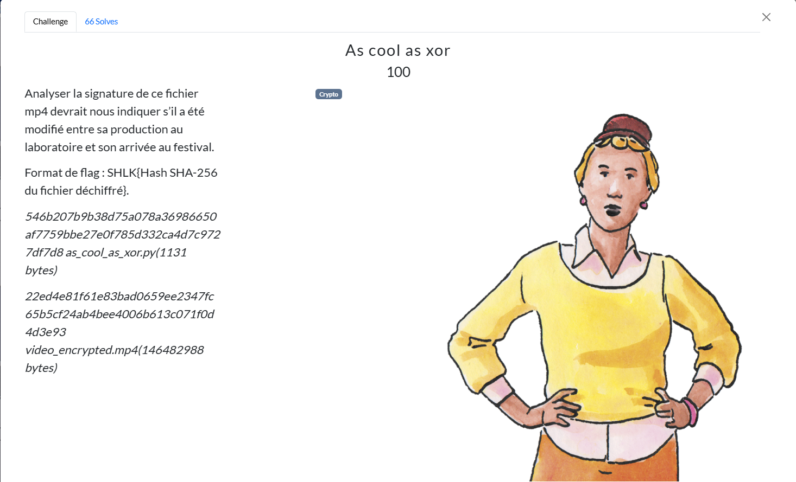
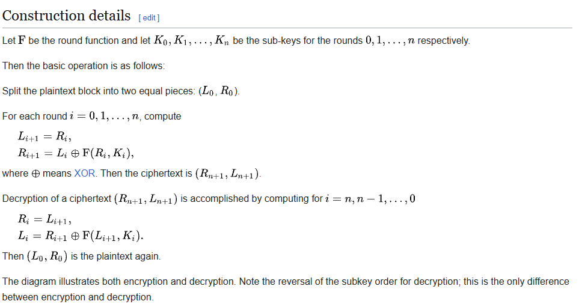
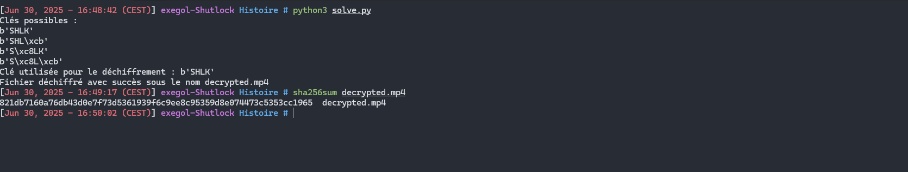

# Writeup

Dans ce challenge, nous avons un fichier MP4 chiffré (`video_encrypted.mp4`) accompagné d’un script Python (`as_cool_as_xor.py`).

Le script `as_cool_as_xor.py` applique **un seul tour** d’un **réseau de Feistel** sur le contenu brut du MP4, avec :
- une **clé de 4 octets**,
- une fonction de ronde  

```python
def func_key(word, key):
        return bytes([(word[i] * key[i % 4]) % 256 for i in range(len(word))])
 ```

 La structure classique de Feistel est :

 

Dans notre cas, n = 0 (un seul tour) et il n’y a qu’une seule clé K0 donc on retrouve exactement :
​
```
L' = R
R' = L ⊕ F(R, key)
```

F étant la `func_key` dans le script.

Tout fichier MP4 commence par la [File type box](https://en.wikipedia.org/wiki/ISO_base_media_file_format#File_type_box)(`ftyp`).

Les 8 premiers octets sont toujours composés de :

- La taille de la boîte (4 octets, big-endian)
- Le tag ASCII "`ftyp`" (4 octets)

Par exemple, si la boîte fait 32 octets, ces 8 octets sont :

 

>[NOTE!] 
> Après un tour de Feistel, la moitié claire se retrouve stockée à partir du point médian du fichier.

On connaît déjà en clair ces 8 octets :

```
L = octets 0–3 (size)
R = octets 4–7 ("ftyp")
```

Dans le fichier **chiffré**, ces mêmes 8 octets apparaissent à :

```
L' = enc[mid : mid+4]
R' = enc[mid+4 : mid+8]
```

D’après Feistel après un tour comme vu précédemment :

```
L' = R
R' = L ⊕ F(R)
```

et comme

```python
F(R)[i] = (R[i] * key[i % 4]) % 256
```

On obtient 4 équations modulo 256 sur les 4 octets inconnus de la clé :

```python
output_encrypted = "video_encrypted.mp4"
with open(output_encrypted, "rb") as f:
    file = f.read()
    f.close()

expected_header = [
    "00000000",
    "00000000",
    "00000000",
    "00011000",
    "01100110",
    "01110100",
    "01111001",
    "01110000",
]

def func_key(word, key):
    return bytes([(word[i] * key[i % 4]) % 256 for i in range(len(word))])

def find_key(base1, base2, output):
    keys = {}
    for idx, elm in enumerate(base1):
        items = []
        for _ in range(256):
            if ((base2[idx] * _) % 256) ^ output[idx] == elm:
                items.append(_)
        if idx % 4 not in keys:
            keys[idx % 4] = items
        else:
            keys[idx % 4] = [elm for elm in items if elm in keys[idx % 4]]
    return keys

mid = len(file) // 2
keys = find_key(
    file[mid:mid + 8],
    file[:8],
    [int(expected_header[i], 2) for i in range(len(expected_header))]
)

print("Clés possibles :")
for k0 in keys[0]:
    for k1 in keys[1]:
        for k2 in keys[2]:
            for k3 in keys[3]:
                key = bytes([k0, k1, k2, k3])
                print(key)

key = bytes([keys[0][0], keys[1][0], keys[2][0], keys[3][0]])
print("Clé utilisée pour le déchiffrement :", key)

F = func_key(file[:mid], key)
L = file[mid:]

with open("decrypted.mp4", "wb") as f:
    f.write(bytes([L[j] ^ F[j] for j in range(len(L))]) + file[:mid])
    f.close()

print("Fichier déchiffré avec succès sous le nom decrypted.mp4")
```

 

 **Flag**

`SHLK{821db7160a76db43d0e7f73d5361939f6c9ee8c95359d8e074473c5353cc1965}`