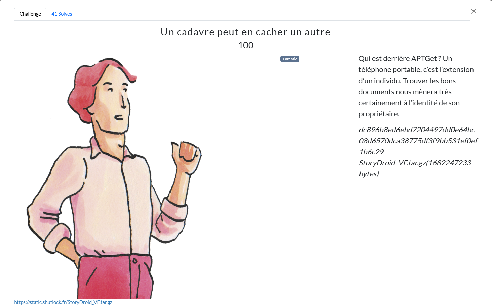
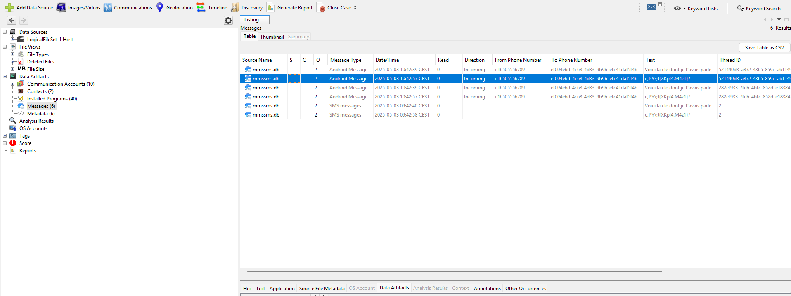
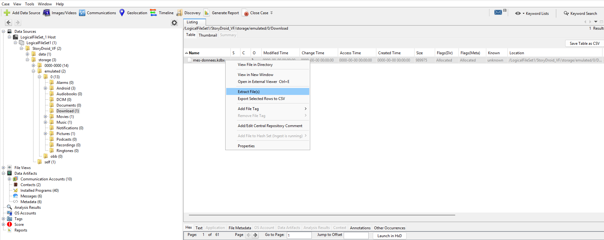
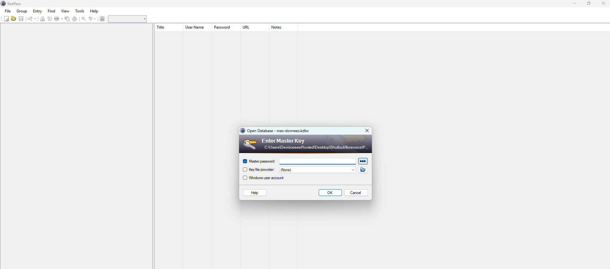
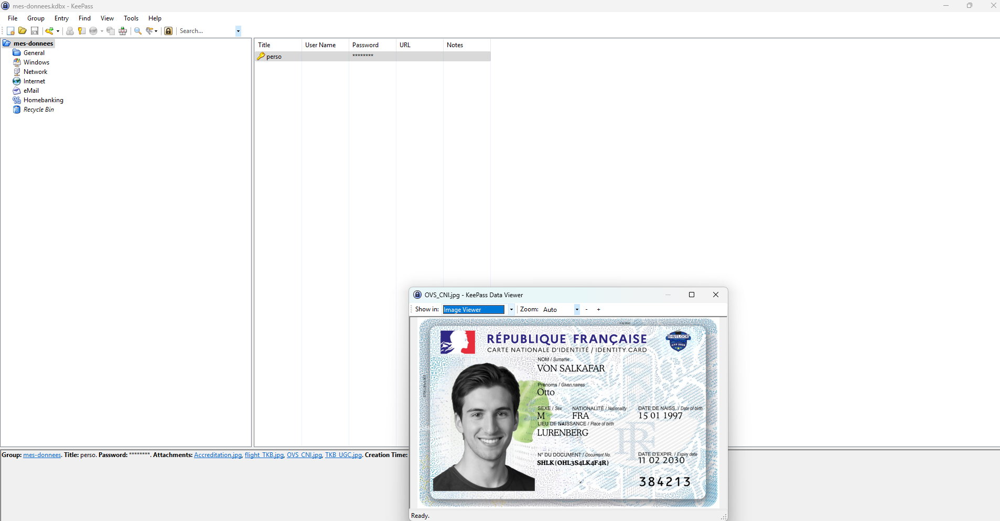

# Writeup

Dans ce challenge, nous avons un backup Android qui contient deux dossiers, `storage` et `data` que l'on peut ouvrir avec Autopsy.

Très vite grâce au logiciel on tombe sur des messages qui mentionnent une clé :

En cherchant encore un peu on trouve un vault Keepass, on peut l'extraire :

En l'ouvrant on nous demande un mot de passe pour le dévérouiller, en utilisant la clé `e,PY\;J{XKp!4.M4z1}7`, on parvient à l'ouvrir, le mot de passe personnel est accompagné de documents dont une fausse carte d'identité qui contient le flag :

**Flag**

`SHLK{OHL3S4LK4F4R}`