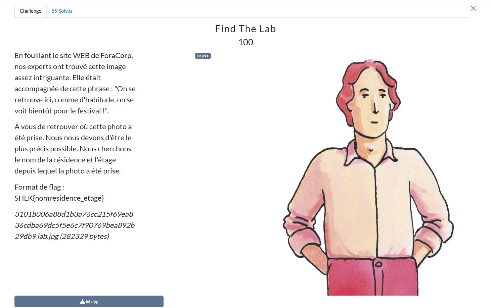
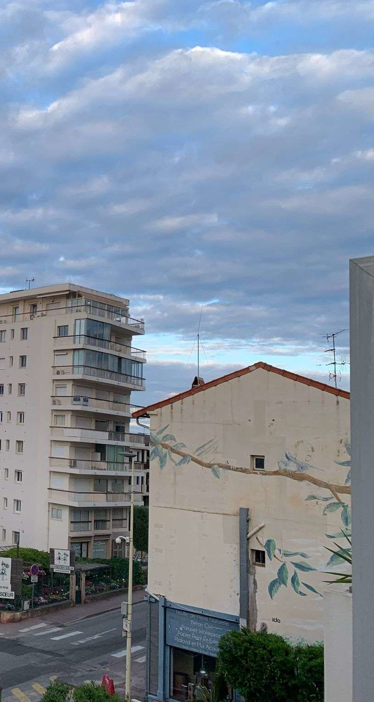
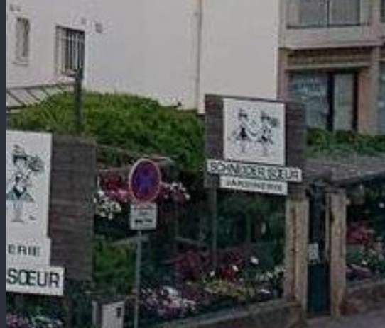
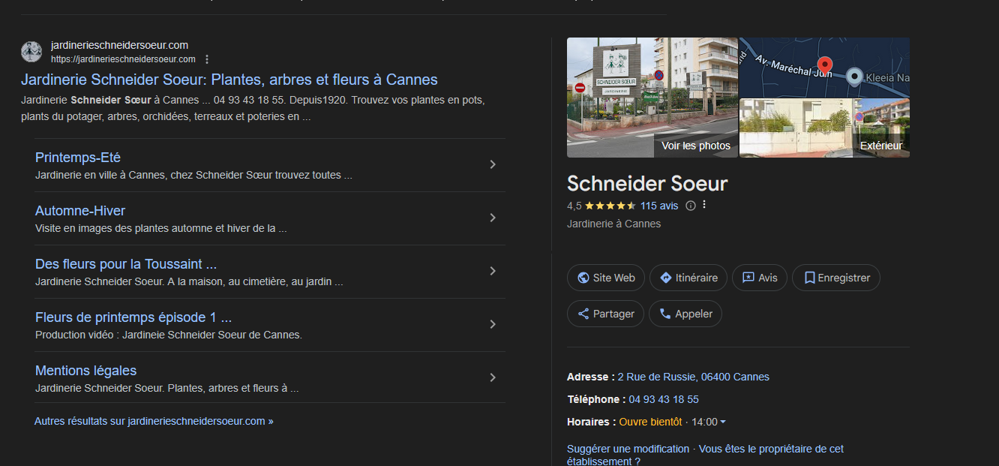
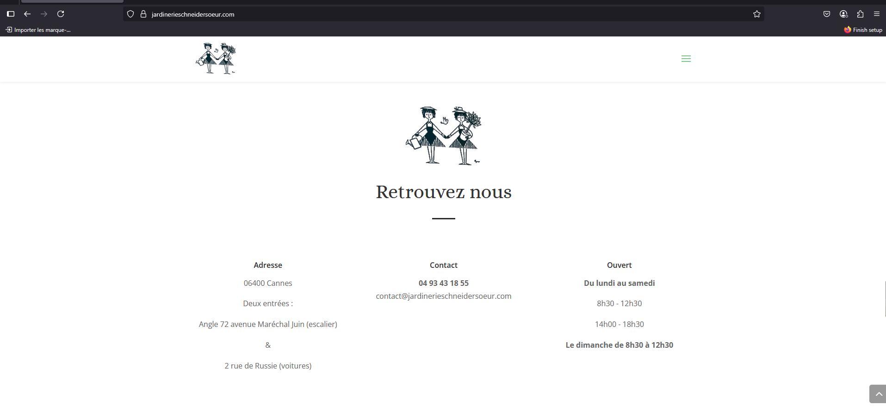
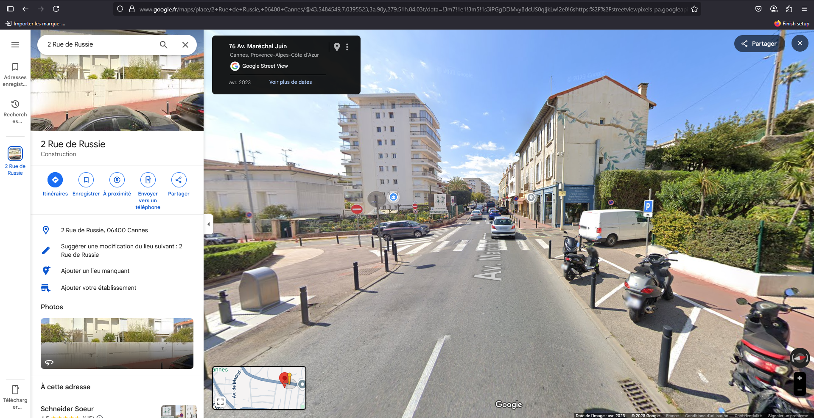
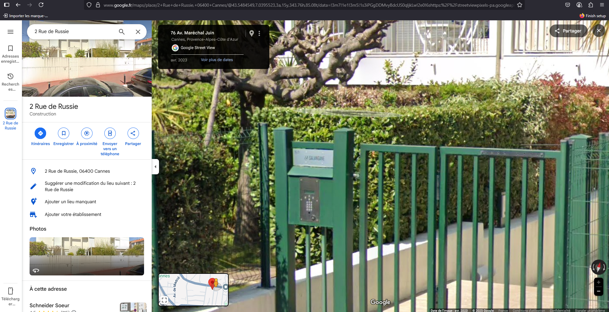
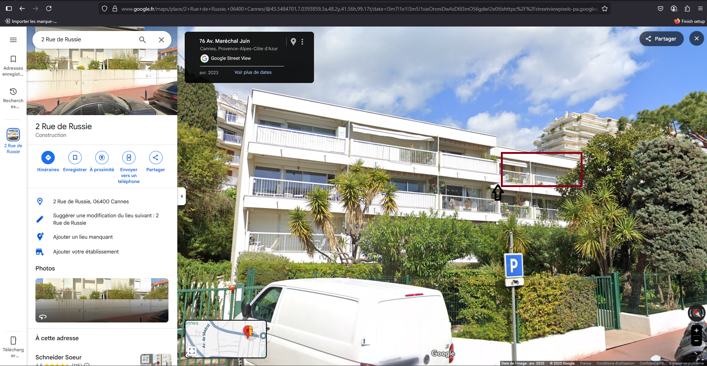

# Writeup

Dans ce challenge on nous fournit une photo prise depuis un "labo", la phrase : "on se voit bientôt pour le Festival" peut nous aiguiller, elle a était prise dans une ville où se trouve un fameux Festival --> Cannes est le plus cohérent par rapport à l'Histoire :

Sur cette photo, plusieurs détails peuvent attirer notre attention comme par exemple la fresque murale, mais en regardant attentivement on peut déduire l'écriture sur le panneau à gauche de l'image :

Il y est inscrit : `SchneiderSoeur`

En faisant une recherche très simple sur un navigateur, on trouve une jardinerie à Cannes qui correspond :

Ensuite on peut utiliser Google Maps pour essayer de repérer où est-ce que la photo a était prise :

Nous pouvons aperçevoir tous les éléments de la photo du laboratoire : la fresque, les panneaux de la jardinnerie et la boutique, la photo a était prise à notre droite.

Le nom de la résidence est : 

`salangane`

Ensuite il ne nous reste plus qu'à trouver l'étage où elle a été prise, sur la photo originale on peut apercevoir un rebord à droite de l'image ici indiqué par une flèche noire :

Etant donné que la photo est prise d'une certaine hauteur, nous pouvons déduire qu'elle a forcément était prise depuis le carré rouge sur la photo ci-dessus au 3ème étage.

**Flag**

`SHLK{salangane_3}`
