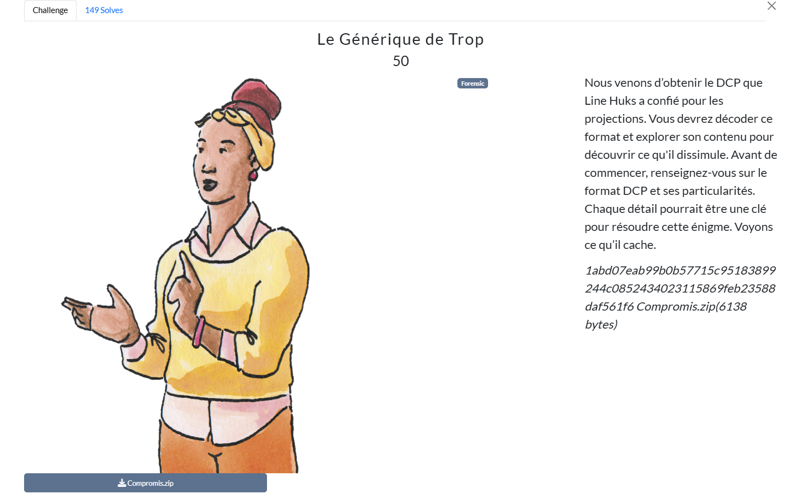

# Writeup

Dans ce challenge, on nous fournit un Digital Cinema Package (DCP) complet :

Un `ASSETMAP.xml` listant tous les fichiers du package,

Une `PKL.xml` (Packing List) validant chacun des assets,

Une `CPL.xml` (Composition Playlist) qui orchestre la lecture des flux,

Les flux `VIDEO.mxf` et `AUDIO.mxf`,

Un fichier de sous-titres `SousTitres.xml`,

En inspectant `SousTitres.xml`, on repère une ligne intéressante :

```html
<Text>
  Dans Ce Pays, Hélas, malgré le fort potentiel qu'il A, C'est une période sombre : il subit un Krack Économique Dramatique.
</Text>
```
En ne conservant que les majuscules, dans l’ordre d’apparition, on reconstitue le flag :

**Flag**

`SHLK{DCPHACKED}`