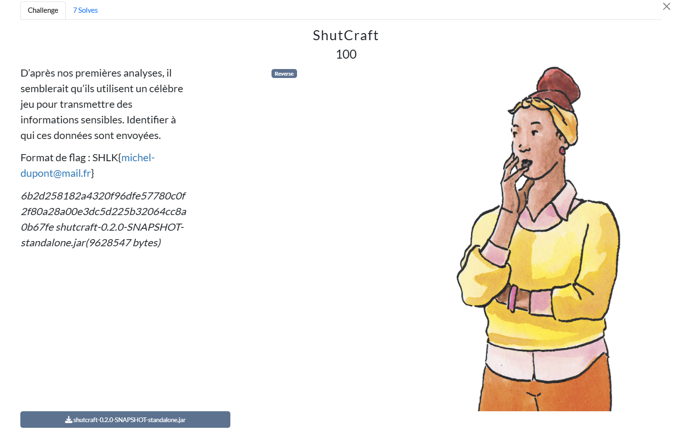
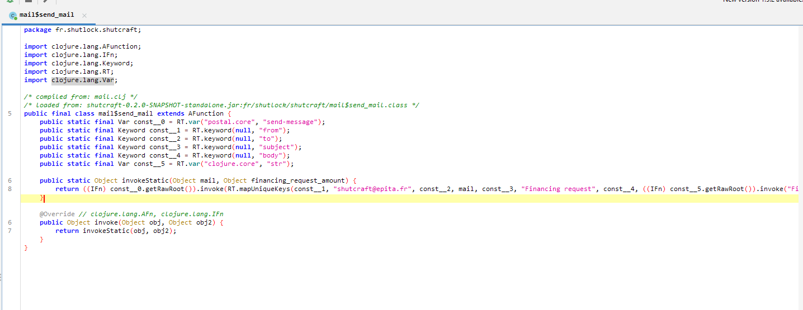
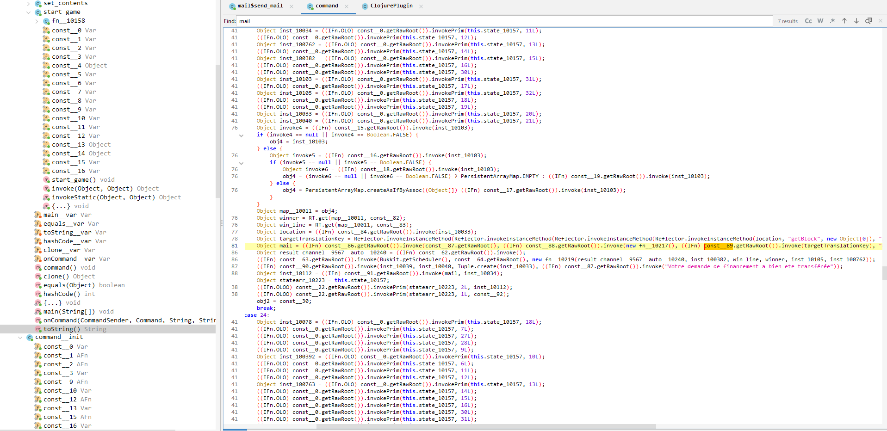
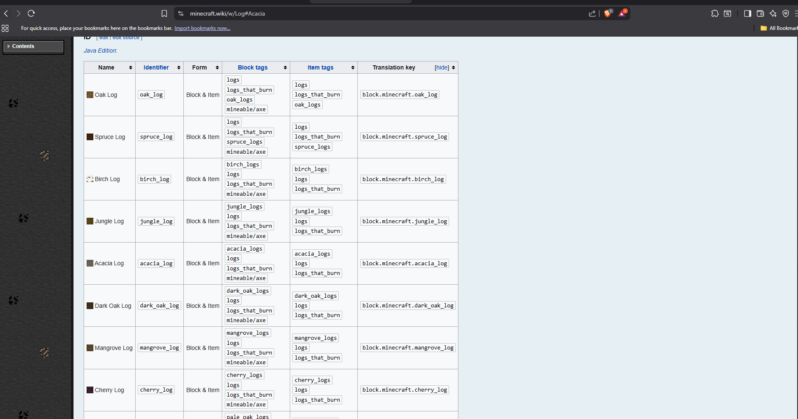
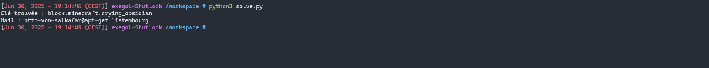

# Writeup

Dans ce challenge, nous avons un plugin `shutcraft-0.2.0-SNAPSHOT-standalone.jar`.

On commence par l'ouvrir avec JADX pour le décompiler, notre but étant de retrouver une adresse email on va se concentrer sur les classes qui contiennent le mot "mail" :

On trouve d'abord une classe `mail$send_mail` avec une adresse mail en clair :



Ce n'est évident pas la bonne adresse mail ça serait un peu trop facile ^^

Dans la sous classe `command$start_game$fn__10158` deux lignes attire notre attention :



```javascript
Object targetTranslationKey = Reflector.invokeInstanceMethod(Reflector.invokeInstanceMethod(Reflector.invokeInstanceMethod(Reflector.invokeInstanceMethod(location, "getBlock", new Object[0]), "getRelative", new Object[]{const__21, const__85, const__21}), "getType", new Object[0]), "getBlockTranslationKey", new Object[0]);

Object mail = ((IFn) const__86.getRawRoot()).invoke(const__87.getRawRoot(), ((IFn) const__88.getRawRoot()).invoke(new fn__10217(), ((IFn) const__89.getRawRoot()).invoke(targetTranslationKey), "\r\u0018\u001b\fFX\u0002\u0007C\u0016\u0002\u001e\n\u0007\u0012O\u00112\u0018\u0019\u001aJ8\n\u0016]\u0005\r\u001a\u0015\u000b\u000f\u000e��\u0016\u0019I"));
```

Ce literal Java contient exactement 37 octets, il est passé à un map avec la fonction fn__10217, qui réalise bit-xor byte-à-byte.


Juste avant l'appel au XOR on lit :

```javascript
Object targetTranslationKey = location
  .getBlock()
  .getRelative(0, -1, 0)
  .getType()
  .getBlockTranslationKey();
  ```

Cette `TranslationKey` est donc la clé utilisée.

`getBlockTranslationKey()` est une méthode de l’API Bukkit (Minecraft), qui renvoie la clé de traduction interne d’un bloc.

En visitant le site https://minecraft.wiki/w/Block et en cliquant sur n'importe quel bloc, on se rend compte que n'importe quelle clé est toujours préfixée par `block.minecraft.`:



On connaît le début de la clé, maintenant il ne nous reste plus qu'à bruteforce le bon bloc pour retrouver l'adresse mail :

```python
from itertools import cycle
import re

cipher_lit = (
    "\r\u0018\u001b\fFX\u0002\u0007C\u0016\u0002\u001e\n"
    "\u0007\u0012O\u00112\u0018\u0019\u001aJ8\n\u0016]\u0005\r"
    "\u001a\u0015\u000b\u000f\u000e\u0000\u0016\u0019I"
)
cipher = cipher_lit.encode('latin-1')

block_names = [
    "stone", "granite", "polished_granite", "diorite", "polished_diorite", "andesite", "polished_andesite",
    "grass_block", "dirt", "coarse_dirt", "podzol", "cobblestone", "oak_planks", "spruce_planks",
    "birch_planks", "jungle_planks", "acacia_planks", "dark_oak_planks", "oak_sapling",
    "spruce_sapling", "birch_sapling", "jungle_sapling", "acacia_sapling", "dark_oak_sapling",  
    "bedrock", "sand", "red_sand", "gravel", "gold_ore", "iron_ore", "coal_ore", "oak_log",
    "spruce_log", "birch_log", "jungle_log", "acacia_log", "dark_oak_log", "stripped_oak_log",
    "stripped_spruce_log", "stripped_birch_log", "stripped_jungle_log", "stripped_acacia_log",
    "stripped_dark_oak_log", "oak_wood", "spruce_wood", "birch_wood", "jungle_wood",
    "acacia_wood", "dark_oak_wood", "stripped_oak_wood", "stripped_spruce_wood",
    "stripped_birch_wood", "stripped_jungle_wood", "stripped_acacia_wood",
    "stripped_dark_oak_wood", "oak_leaves", "spruce_leaves", "birch_leaves", "jungle_leaves",
    "acacia_leaves", "dark_oak_leaves", "sponge", "wet_sponge", "glass", "lapis_ore",
    "lapis_block", "sandstone", "chiseled_sandstone", "cut_sandstone", "note_block",
    "white_bed", "orange_bed", "magenta_bed", "light_blue_bed", "yellow_bed", "lime_bed",
    "pink_bed", "gray_bed", "light_gray_bed", "cyan_bed", "purple_bed", "blue_bed",
    "brown_bed", "green_bed", "red_bed", "black_bed", "powered_rail", "detector_rail",
    "sticky_piston", "cobweb", "grass", "fern", "dead_bush", "seagrass", "tall_seagrass",
    "piston", "piston_head", "white_wool", "orange_wool", "magenta_wool", "light_blue_wool",
    "yellow_wool", "lime_wool", "pink_wool", "gray_wool", "light_gray_wool", "cyan_wool",
    "purple_wool", "blue_wool", "brown_wool", "green_wool", "red_wool", "black_wool",
    "dandelion", "poppy", "blue_orchid", "allium", "azure_bluet", "red_tulip",
    "orange_tulip", "white_tulip", "pink_tulip", "oxeye_daisy", "cornflower",
    "lily_of_the_valley", "wither_rose", "brown_mushroom", "red_mushroom", "gold_block",
    "iron_block", "oak_slab", "spruce_slab", "birch_slab", "jungle_slab", "acacia_slab",
    "dark_oak_slab", "stone_slab", "smooth_stone_slab", "sandstone_slab", "cut_sandstone_slab",
    "petrified_oak_slab", "cobblestone_slab", "brick_slab", "stone_brick_slab",
    "nether_brick_slab", "quartz_slab", "red_sandstone_slab", "cut_red_sandstone_slab",
    "purpur_slab", "prismarine_slab", "prismarine_brick_slab", "dark_prismarine_slab",
    "smooth_quartz_slab", "oak_stairs", "spruce_stairs", "birch_stairs", "jungle_stairs",
    "acacia_stairs", "dark_oak_stairs", "stone_stairs", "brick_stairs", "stone_brick_stairs",
    "nether_brick_stairs", "sandstone_stairs", "red_sandstone_stairs", "spruce_stairs",
    "birch_stairs", "jungle_stairs", "acacia_stairs", "dark_oak_stairs", "stone_stairs",
    "brick_stairs", "stone_brick_stairs", "nether_brick_stairs", "sandstone_stairs",
    "red_sandstone_stairs", "spruce_stairs", "birch_stairs", "jungle_stairs", "acacia_stairs",
    "dark_oak_stairs", "stone_stairs", "brick_stairs", "stone_brick_stairs", "nether_brick_stairs",
    "sandstone_stairs", "red_sandstone_stairs", "emerald_ore", "ender_chest",
    "tripwire_hook", "tripwire", "emerald_block", "spruce_stairs", "birch_stairs",
    "jungle_stairs", "acacia_stairs", "dark_oak_stairs", "command_block", "beacon",
    "cobblestone_wall", "mossy_cobblestone_wall", "brick_wall", "prismarine_wall",
    "red_sandstone_wall", "mossy_stone_brick_wall", "granite_wall", "stone_brick_wall",
    "nether_brick_wall", "andesite_wall", "red_nether_brick_wall", "sandstone_wall",
    "end_stone_brick_wall", "diorite_wall", "blackstone_wall", "polished_blackstone_wall",
    "polished_blackstone_brick_wall", "cobbled_deepslate_wall", "polished_deepslate_wall",
    "deepslate_brick_wall", "deepslate_tile_wall", "anvil", "chipped_anvil", "damaged_anvil",
    "chest", "trapped_chest", "light_weighted_pressure_plate", "heavy_weighted_pressure_plate",
    "comparator", "daylight_detector", "redstone_block", "nether_quartz_ore", "hopper",
    "quartz_block", "chiseled_quartz_block", "quartz_pillar", "quartz_stairs",
    "activator_rail", "dropper", "white_terracotta", "orange_terracotta", "magenta_terracotta",
    "light_blue_terracotta", "yellow_terracotta", "lime_terracotta", "pink_terracotta",
    "gray_terracotta", "light_gray_terracotta", "cyan_terracotta", "purple_terracotta",
    "blue_terracotta", "brown_terracotta", "green_terracotta", "red_terracotta",
    "black_terracotta", "white_stained_glass", "orange_stained_glass", "magenta_stained_glass",
    "light_blue_stained_glass", "yellow_stained_glass", "lime_stained_glass",
    "pink_stained_glass", "gray_stained_glass", "light_gray_stained_glass",
    "cyan_stained_glass", "purple_stained_glass", "blue_stained_glass",
    "brown_stained_glass", "green_stained_glass", "red_stained_glass", "black_stained_glass",
    "white_stained_glass_pane", "orange_stained_glass_pane", "magenta_stained_glass_pane",
    "light_blue_stained_glass_pane", "yellow_stained_glass_pane", "lime_stained_glass_pane",
    "pink_stained_glass_pane", "gray_stained_glass_pane", "light_gray_stained_glass_pane",
    "cyan_stained_glass_pane", "purple_stained_glass_pane", "blue_stained_glass_pane",
    "brown_stained_glass_pane", "green_stained_glass_pane", "red_stained_glass_pane",
    "black_stained_glass_pane", "prismarine", "prismarine_bricks", "dark_prismarine",
    "prismarine_stairs", "prismarine_brick_stairs", "dark_prismarine_stairs", "sea_lantern",
    "hay_block", "white_carpet", "orange_carpet", "magenta_carpet", "light_blue_carpet",
    "yellow_carpet", "lime_carpet", "pink_carpet", "gray_carpet", "light_gray_carpet",
    "cyan_carpet", "purple_carpet", "blue_carpet", "brown_carpet", "green_carpet",
    "red_carpet", "black_carpet", "terracotta", "coal_block", "packed_ice", "sunflower",
    "lilac", "rose_bush", "peony", "tall_grass", "large_fern", "white_banner",
    "orange_banner", "magenta_banner", "light_blue_banner", "yellow_banner",
    "lime_banner", "pink_banner", "gray_banner", "light_gray_banner", "cyan_banner",
    "purple_banner", "blue_banner", "brown_banner", "green_banner", "red_banner",
    "black_banner", "end_rod", "chorus_plant", "chorus_flower", "purpur_block",
    "purpur_pillar", "purpur_stairs", "purpur_slab", "end_stone_bricks", "beetroots",
    "grass_path", "end_gateway", "repeating_command_block", "chain_command_block",
    "frosted_ice", "magma_block", "nether_wart_block", "red_nether_bricks",
    "bone_block", "structure_void", "observer", "white_shulker_box", "orange_shulker_box",
    "magenta_shulker_box", "light_blue_shulker_box", "yellow_shulker_box",
    "lime_shulker_box", "pink_shulker_box", "gray_shulker_box", "light_gray_shulker_box",
    "cyan_shulker_box", "purple_shulker_box", "blue_shulker_box", "brown_shulker_box",
    "green_shulker_box", "red_shulker_box", "black_shulker_box", "white_glazed_terracotta",
    "orange_glazed_terracotta", "magenta_glazed_terracotta", "light_blue_glazed_terracotta",
    "yellow_glazed_terracotta", "lime_glazed_terracotta", "pink_glazed_terracotta",
    "gray_glazed_terracotta", "light_gray_glazed_terracotta", "cyan_glazed_terracotta",
    "purple_glazed_terracotta", "blue_glazed_terracotta", "brown_glazed_terracotta",
    "green_glazed_terracotta", "red_glazed_terracotta", "black_glazed_terracotta",
    "white_concrete", "orange_concrete", "magenta_concrete", "light_blue_concrete",
    "yellow_concrete", "lime_concrete", "pink_concrete", "gray_concrete",
    "light_gray_concrete", "cyan_concrete", "purple_concrete", "blue_concrete",
    "brown_concrete", "green_concrete", "red_concrete", "black_concrete", "white_concrete_powder",
    "orange_concrete_powder", "magenta_concrete_powder", "light_blue_concrete_powder",
    "yellow_concrete_powder", "lime_concrete_powder", "pink_concrete_powder",
    "gray_concrete_powder", "light_gray_concrete_powder", "cyan_concrete_powder",
    "purple_concrete_powder", "blue_concrete_powder", "brown_concrete_powder",
    "green_concrete_powder", "red_concrete_powder", "black_concrete_powder", "turtle_egg",
    "dead_tube_coral_block", "dead_brain_coral_block", "dead_bubble_coral_block",
    "dead_fire_coral_block", "dead_horn_coral_block", "tube_coral_block", "brain_coral_block",
    "bubble_coral_block", "fire_coral_block", "horn_coral_block", "tube_coral",
    "brain_coral", "bubble_coral", "fire_coral", "horn_coral", "dead_brain_coral",
    "dead_bubble_coral", "dead_fire_coral", "dead_horn_coral", "dead_tube_coral",
    "tube_coral_fan", "brain_coral_fan", "bubble_coral_fan", "fire_coral_fan",
    "horn_coral_fan", "dead_tube_coral_fan", "dead_brain_coral_fan", "dead_bubble_coral_fan",
    "dead_fire_coral_fan", "dead_horn_coral_fan", "blue_ice", "conduit", "polished_granite_stairs",
    "smooth_red_sandstone_stairs", "mossy_stone_brick_stairs", "polished_diorite_stairs",
    "mossy_cobblestone_stairs", "end_stone_brick_stairs", "stone_stairs",
    "smooth_sandstone_stairs", "smooth_quartz_stairs", "granite_stairs", "andesite_stairs",
    "red_nether_brick_stairs", "polished_andesite_stairs", "diorite_stairs",
    "polished_granite_slab", "smooth_red_sandstone_slab", "mossy_stone_brick_slab",
    "polished_diorite_slab", "mossy_cobblestone_slab", "end_stone_brick_slab", "smooth_stone_slab",
    "smooth_sandstone_slab", "smooth_quartz_slab", "granite_slab", "andesite_slab",
    "red_nether_brick_slab", "polished_andesite_slab", "diorite_slab", "brick_wall",
    "prismarine_wall", "red_sandstone_wall", "mossy_stone_brick_wall", "granite_wall",
    "stone_brick_wall", "nether_brick_wall", "andesite_wall", "red_nether_brick_wall",
    "sandstone_wall", "end_stone_brick_wall", "diorite_wall", "scaffolding", "loom",
    "barrel", "smoker", "blast_furnace", "cartography_table", "fletching_table",
    "grindstone", "lectern", "smithing_table", "stonecutter", "bell", "lantern",
    "soul_lantern", "campfire", "soul_campfire", "sweet_berry_bush", "warped_stem",
    "stripped_warped_stem", "warped_hyphae", "stripped_warped_hyphae", "warped_nylium",
    "warped_fungus", "warped_wart_block", "warped_roots", "nether_sprouts", "crimson_stem",
    "stripped_crimson_stem", "crimson_hyphae", "stripped_crimson_hyphae", "crimson_nylium",
    "crimson_fungus", "shroomlight", "weeping_vines", "weeping_vines_plant", "twisting_vines",
    "twisting_vines_plant", "crimson_roots", "crimson_planks", "warped_planks",
    "crimson_slab", "warped_slab", "crimson_pressure_plate", "warped_pressure_plate",
    "crimson_fence", "warped_fence", "crimson_trapdoor", "warped_trapdoor", "crimson_fence_gate",
    "warped_fence_gate", "crimson_stairs", "warped_stairs", "crimson_button", "warped_button",
    "crimson_door", "warped_door", "crimson_sign", "warped_sign", "soul_soil", "soul_fire",
    "basalt", "polished_basalt", "soul_torch", "soul_wall_torch", "chain", "nether_gold_ore",
    "crying_obsidian", "blackstone", "blackstone_stairs", "blackstone_wall", "blackstone_slab",
    "gilded_blackstone", "polished_blackstone", "polished_blackstone_stairs",
    "polished_blackstone_slab", "polished_blackstone_pressure_plate", "polished_blackstone_button",
    "polished_blackstone_wall", "chiseled_polished_blackstone", "cracked_polished_blackstone_bricks",
    "polished_blackstone_bricks", "respawn_anchor", "lodestone", "ancient_debris", "netherite_block"
]

mail_re = re.compile(r'^[A-Za-z0-9._%+-]+@[A-Za-z0-9.-]+\.[A-Za-z]{2,}$')

for block_name in block_names:
    key = f"block.minecraft.{block_name}".encode('latin-1')
    plain = bytes(c ^ k for c, k in zip(cipher, cycle(key)))
    if not all(32 <= b < 127 for b in plain):
        continue
    try:
        text = plain.decode('ascii')
    except UnicodeDecodeError:
        continue
    if mail_re.match(text):
        print(f"Clé trouvée : block.minecraft.{block_name}")
        print("Mail :", text)
        break
else:
    print("Clé non trouvée")
```



**Flag:**

```
SHLK{otto-von-salkafar@apt-get.listembourg}
```
