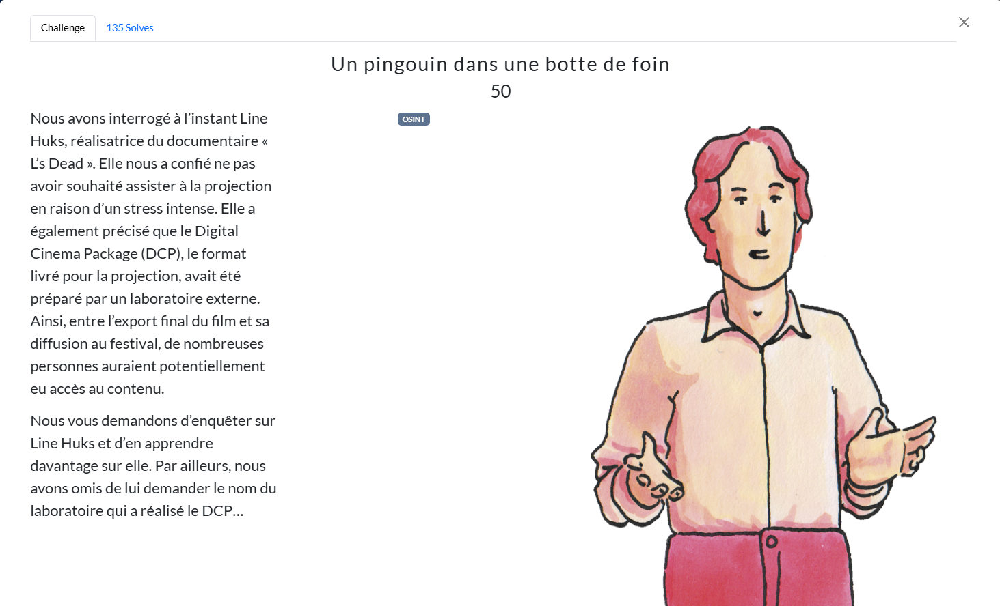
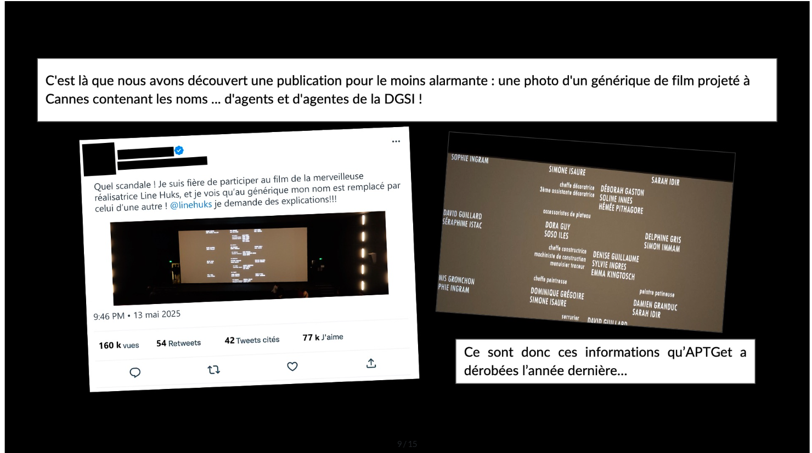
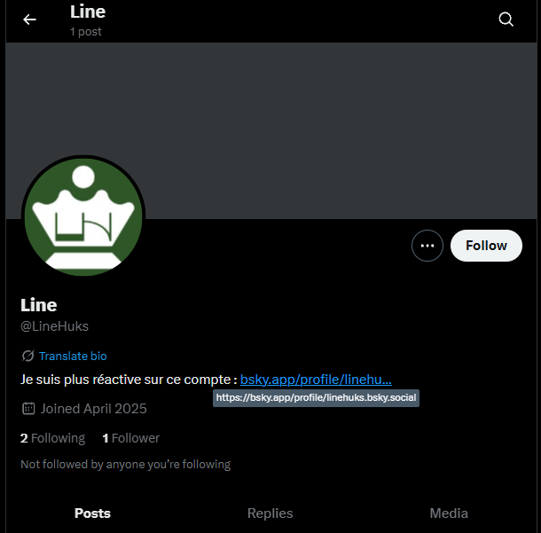
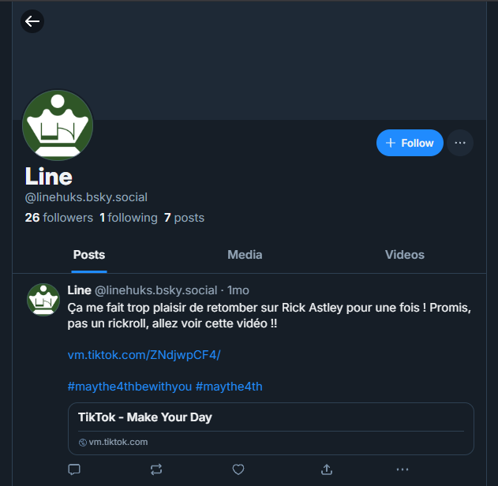
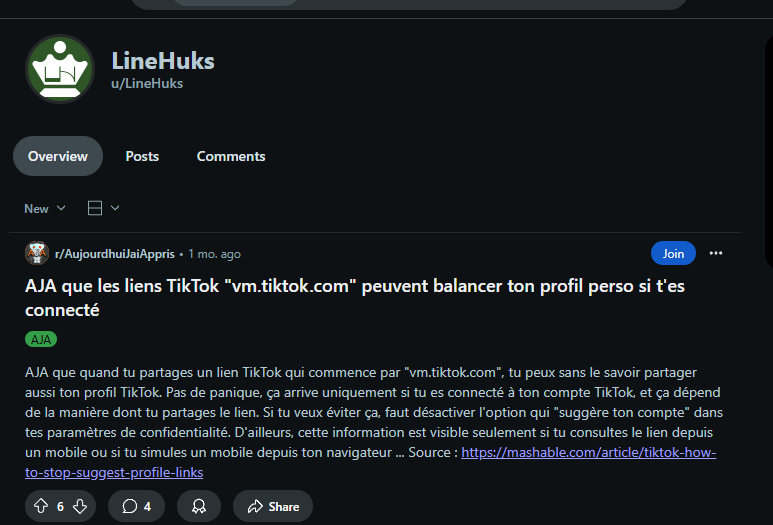
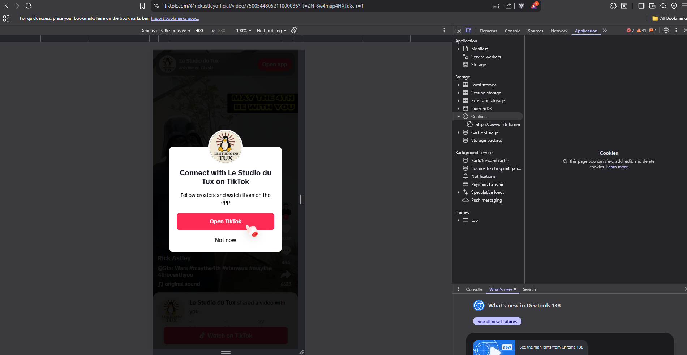
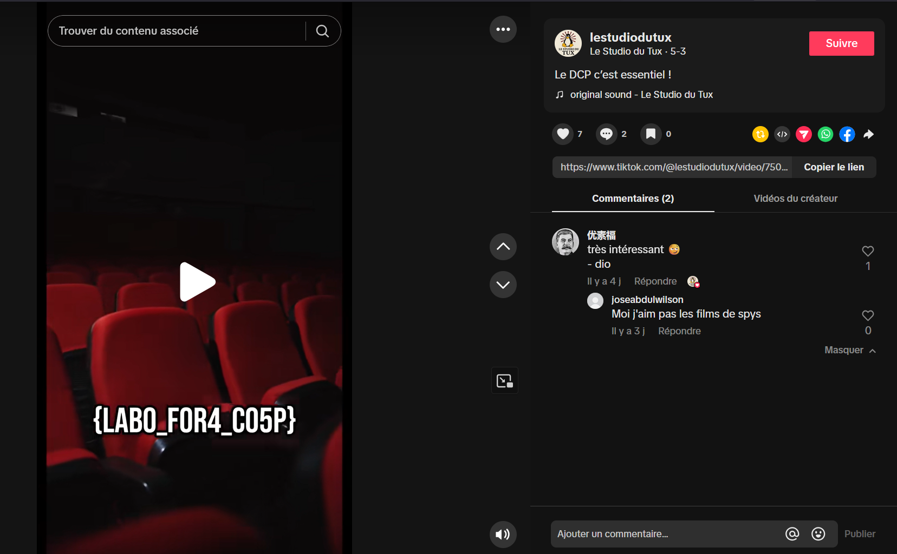

# Writeup

Dans ce challenge, on nous demande d'enquêter sur une certaine "Line Hulks et de retrouver le nom du laboratoire qui a réalisé le DCP.

En lisant attentivement l'introduction on peut remarquer qu'elle est mentionnéé dans un tweet :



Elle apparaît ici sous le pseudonyme @linehuks, en se rendant sur son profil X, elle nous redirige sur son compte bsky où elle se dit plus active :



Ce qui attire directement notre attention quand on atterit sur ce profil est un lien vers une vidéo tiktok : 



En cliquant sur ce lien, à première vue c'est une simple vidéo tiktok de Rick Astley.

Nous pouvons ensuite faire une recherche sur https://whatsmyname.app/ pour essayer de trouver d'autres correspondances pour "LineHuks", on tombe sur un profil reddit très intéressant :



Il est indiqué que l'information qui suggère un compte à partir d'un lien "vm.tiktok.com" est disponible uniquement depuis un mobile ou si l'on simule un mobile depuis un navigateur.

--> On peut donc simuler un mobile et un compte est suggéré :



Ensuite, en regardant quelques vidéos du compte, on trouve la vidéo qui contient le nom du laboratoire DCP :



**Flag:**

```
SHLK{LABO_FOR4_CO5P}
```
