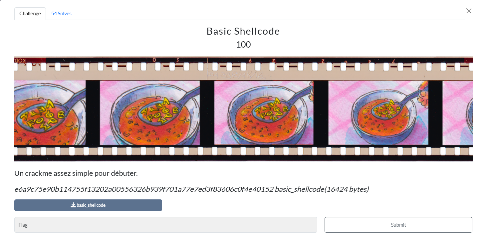
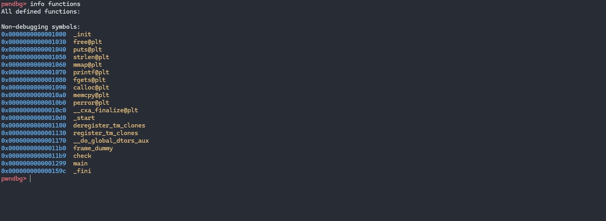
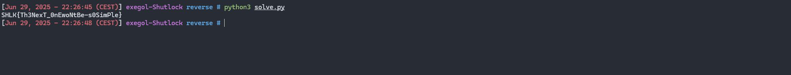

# Writeup

Dans ce challenge on nous fournit un binaire linux exécutable :

```zsh
basic_shellcode: ELF 64-bit LSB pie executable, x86-64, version 1 (SYSV), dynamically linked, interpreter /lib64/ld-linux-x86-64.so.2, BuildID[sha1]=0349fb6f9aa93e2ee9dd268d6f796dc80674d68b, for GNU/Linux 3.2.0, not stripped
```

Quand on l'éxécute on nous demande de fournir un flag :


```zsh
[Jun 29, 2025 - 19:32:11 (CEST)] exegol-Shutlock reverse # ./basic_shellcode
Enter the flag here : test
Try again!
```

Si ce flag est incorrect le programme renvoit la chaîne `Try again!`

On peut vérifier les protections du binaire avec `checksec` :

```zsh
[Jun 29, 2025 - 21:16:02 (CEST)] exegol-Shutlock reverse # checksec --file=basic_shellcode
[*] '/workspace/reverse/basic_shellcode'
    Arch:       amd64-64-little
    RELRO:      Partial RELRO
    Stack:      No canary found
    NX:         NX enabled
    PIE:        PIE enabled
    Stripped:   No
```

Comme le binaire n'est pas strippé, on peut lister les fonctions :



On peut ouvrir le binaire dans `Ghidra` pour decompiler ses fonctions et comprendre comment le programme valide ou non le flag.

Voici une explication de ce que fait la fonction `main` :

```c

undefined8 main(void)

{
  size_t __nmemb;
  char *pcVar1;
  // shellcode de 173 octets stocké dans la pile
  undefined8 uVar2;
  undefined8 local_e8;
  undefined8 local_e0;
  undefined8 local_d8;
  undefined8 local_d0;
  undefined8 local_c8;
  undefined8 local_c0;
  undefined8 local_b8;
  undefined8 local_b0;
  undefined8 local_a8;
  undefined8 local_a0;
  undefined8 local_98;
  undefined8 local_90;
  undefined8 local_88;
  undefined8 local_80;
  undefined8 local_78;
  undefined8 local_70;
  undefined8 local_68;
  undefined8 local_60;
  undefined8 local_58;
  undefined5 local_50;
  undefined3 uStack75;
  undefined5 uStack72;
  undefined8 local_43;
  char local_39;
  code *local_38;
  code *local_30;
  char *local_28;
  char *local_20;
  char **local_18;
  uint local_c;
  
  local_e8 = 0xc748564155415441;
  local_e0 = 0x148b4c00000001c0;
  local_d8 = 0x84850f20fa8349c7;
  local_d0 = 0x7c3c749000000;
  local_c8 = 0x2c0c7480000;
  local_c0 = 0xc5c749c7248b4c00;
  local_b8 = 0xc0c74800000000;
  local_b0 = 0x4cc7348b4c000000;
  local_a8 = 0xd23148e5f749d889;
  local_a0 = 0x412e048a43f2f749;
  local_98 = 0x4d01c58349140488;
  local_90 = 0x3c0c748e37cd539;
  local_88 = 0x48c7348b4c000000;
  local_80 = 0xc74900000001c2c7;
  local_78 = 0xe7894c00000001c3;
  local_70 = 0xff41534152de894c;
  local_68 = 0x49c221485a5b41d6;
  local_60 = 0x4908c4834901c383;
  local_58 = 0xd08948e07c05fb83;
  local_50 = 0x415d415e41;
  uStack75 = 0x48c35c;
  uStack72 = 0xc0c7;
  local_43 = 0xc35c415d415e4100;
  local_c = 0xad;
  // lecture du flag utilisateur
  local_18 = (char **)calloc(1,0x20); // argv[]
  local_20 = (char *)calloc(0x100,1); // buffer de saisie
  printf("Enter the flag here : ");
  local_20 = fgets(local_20,0xff,stdin);
  __nmemb = strlen(local_20);
  local_20[__nmemb - 1] = '\0'; // supprime le '\n'
  local_28 = (char *)(__nmemb - 1);

  // tableau d'arguments pour le shellcode
  *local_18 = local_20; // argv[0] = input
  local_18[1] = local_28; // argv[1] = length-1
  pcVar1 = (char *)calloc(__nmemb,1);
  local_18[2] = pcVar1; // argv[2] = buffer vierge
  local_18[3] = (char *)check; // argv[3] = &check

  // allocation d'une zone mémoire exécutable
  local_30 = (code *)mmap((void *)0x0,(ulong)local_c,7,0x22,-1,0);
  if (local_30 == (code *)0xffffffffffffffff) {
    perror("mmap");
    uVar2 = 1;
  }
  else {
    memcpy(local_30,&local_e8,(ulong)local_c); //copie du blob en mémoire
    local_38 = local_30;
    local_39 = (*local_30)(local_18); //appel du shellcode
    free(*local_18);
    free(local_18[2]);
    free(local_18);

    // affichage renvoyé par le shellcode
    if (local_39 == '\0') {
      puts("Try again!");
    }
    else {
      puts("This is the right flag!");
    }
    uVar2 = 0;
  }
  return uVar2;
}
```

La vérification se fait dans la fonction `check`.

Voici une explication de cette fonction décompilé en Pseudo-C :

```c
bool check(long param_1,int param_2) // param 1 (RDI) --> pointeur vers le buffer de 32 octects | param 2 (ESI) numéro du bloc de 1 à 4, le shellcode appelle 4 fois

{
  # Constantes
  undefined8 local_58;
  undefined8 local_50;
  undefined local_48;
  undefined8 local_38;
  undefined8 local_30;
  undefined8 local_28;
  undefined8 local_20;
  undefined local_18;
  bool local_11;
  ulong local_10;
  
  # Copie de deux tables dans la pile
  
  local_38 = 0xe2d4429123b432a; // table2[0..7]
  local_30 = 0x3702212d0826305f; // table2[8..15]
  local_28 = 0x5f111232551d6a1a; // table2[16..23]
  local_20 = 0x1c0b26094968363c; // table2[24..31]
  local_18 = 0;
  local_58 = 0x644e756f46553079; // table1[0..7]
  local_50 = 0x79454b723078596d; // table1[8..15]
  local_48 = 0;
  local_11 = true; // valeur de retour initiale, si un octet ne correspond pas cette variable sera remise à 0
  for (local_10 = 0; local_10 < 8; local_10 = local_10 + 1) {
    local_11 = ((*(byte *)(local_10 + param_1) ^  // octet du buffer permuté
                *(byte *)((long)&local_58 + (long)((param_2 + -1) * 4) + (ulong)((uint)local_10 & 3) // XOR table1
                         )) == *(byte *)((long)&local_38 + local_10 + (long)((param_2 + -1) * 8)) & // doit égaler table2
               local_11) != 0;
  }
  return local_11;
}
```

On peut donc inverser la vérification  :

```python
t1 = bytes.fromhex("79 30 55 46 6f 75 4e 64")          # 16 o  : table1
t2 = bytes.fromhex("2a 43 3b 12 29 44 2d 0e"           # 32 o  : table2
                   "5f 37 02 21 2d 08 26 30"
                   "5f 11 12 32 55 1d 6a 1a"
                   "1c 0b 26 09 49 68 36 3c")

perm = bytes(t1[i % 4] ^ t2[i] for i in range(32))
```

Maintenant il ne reste plus qu'à inverse la permutation appliqué par le shellcode pour retrouver le vrai flag :

```python
# tables
t1 = bytes.fromhex(
    "79 30 55 46 6f 75 4e 64"  # 0x644e756f46553079
    "6d 59 78 30 72 4b 45 79"  # 0x79454b723078596d
)                              # y0UFouNdmYx0rKEy

t2 = bytes.fromhex(
    "2a 43 3b 12 29 44 2d 0e" # 0x0e2d4429123b432a
    "5f 30 26 08 2d 21 02 37" # 0x3702212d0826305f
    "1a 6a 1d 55 32 12 11 5f" # 0x5f111232551d6a1a
    "3c 36 68 49 09 26 0b 1c" # 0x1c0b26094968363c
)

perm_bytes = []
for n in range(4): # n = 0..3  (quatre blocs)
    for j in range(8): # j = 0..7  (huit octets par bloc)
        k1 = t1[4*n + (j & 3)] # table1, offset 4*(n) + (j mod 4)
        k2 = t2[8*n + j] # table2, offset 8*(n) + j
        perm_bytes.append(k1 ^ k2)

perm = bytes(perm_bytes)

# inverser la permutation
flag = [''] * 32
for pos_in_perm in range(32):
    pos_in_flag = (pos_in_perm * 23) % 32 # 7⁻¹ mod 32 = 23
    flag[pos_in_flag] = chr(perm[pos_in_perm])

print(''.join(flag))
```



**Flag**

`SHLK{Th3NexT_0nEwoNtBe-s0SimPle}`


