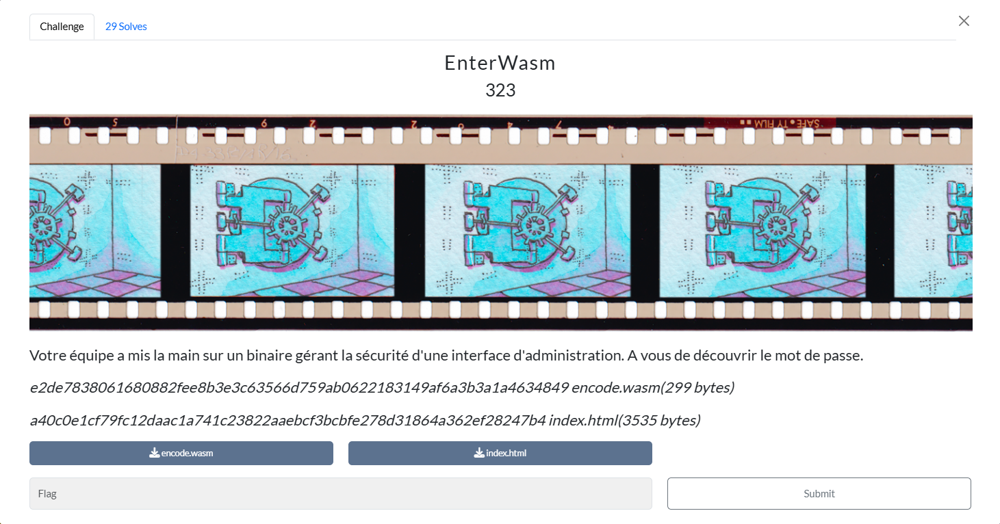

# Writeup

Dans ce challenge on nous met à disposition deux fichiers :

```zsh
[Jun 29, 2025 - 22:46:00 (CEST)] exegol-Shutlock EnterWasm # file encode.wasm
encode.wasm: WebAssembly (wasm) binary module version 0x1 (MVP)
[Jun 29, 2025 - 22:46:03 (CEST)] exegol-Shutlock EnterWasm # file index.html
index.html: HTML document, ASCII text
[Jun 29, 2025 - 22:46:08 (CEST)] exegol-Shutlock EnterWasm #
```

Nous pouvons ouvrir index.html pour comprendre son fonctionnement :

```html
<input id="input-container" autofocus maxlength="8">
<pre id="logme"></pre>

<script>
  let memory;

  // une fonction callback pour afficher depuis WASM
  function log(length) {
    let bytes = memory.slice(0, length);
    let msg = new TextDecoder('utf8').decode(bytes);
    document.getElementById("logme")
            .innerText += "[+] " + msg + "\n";
  }

  // instancie le module WASM avec un import 'js.debug'
  WebAssembly.instantiateStreaming(
    fetch("encode.wasm", {cache: "no-cache"}),
    { js: { debug: x => log(x) } }
  ).then(wasm => {
    const wasmi = wasm.instance.exports;
    // recupère l'ArrayBuffer mémoire
    memory = wasm.instance.exports.memory.buffer;

    // appuie de la touche "entrée"
    document.addEventListener("keydown", e => {
      if (e.key !== "Enter") return;
      const text = document.getElementById("input-container").value;
      const encoded = new TextEncoder().encode(text);
      if (encoded.length !== 8) {
        document.getElementById("logme")
                .innerText = "[+] 8 characters (ISO-8859-1) needed.\n";
        return;
      }
      // injecte les octets dans la mémoire WASM à l’offset 0
      new Uint8Array(memory).set(encoded);

      // appelle la fonction check() exportée
      const res = wasmi.check();
      if (res === 0) log("Access Denied");
      if (res === 1) log("Access Granted: SHLK{" + text + "}");
    });
  });
</script>
```

On peut convertir le binaire en WAT :

```zsh
wasm2wat encode.wasm -o encode.wat
```

Il faut ensuite se poser longement sur le fichier encode.wat pour comprendre son fonctionnement :

```c
(module
  (type (;0;) (func (param i32))) 
  (type (;1;) (func (param i32) (result i32))) // type 1 : signature de la fonction check(ptr) --> i32 (bool)
  (func (;0;) (type 0) (param i32) // func0 : rotation droite de 32 bits sur les mots à ptr et ptr+4
    i32.const 0 // offset 0
    i32.const 0 // adresse ptr+0
    i32.load // w = load32(ptr + 0)
    local.get 0  // récupérer ptr
    i32.rotr  // w = rotr(w, ptr mod 32)
    i32.store // store32(ptr + 0, w)
    i32.const 4 // offset 4
    i32.const 4 // adresse ptr+4
    i32.load // w = load32(ptr + 4)
    local.get 0  // récupérer ptr
    i32.rotr / w = rotr(w, ptr mod 32)
    i32.store) // store32(ptr + 4, w)

  (func (;1;) (type 0) (param i32) // func1 : XOR placeholder
    i32.const 0
    i32.const 0
    i32.load // v = load32(ptr + 0)
    local.get 0 
    i32.xor // v ^= v
    i32.store // store32(ptr + 0, v)
    i32.const 4
    i32.const 4
    i32.load // v = load32(ptr + 4)
    local.get 0
    i32.xor // v ^= v
    i32.store) // store32(ptr + 4, v)
  (func (;2;) (type 0) (param $ptr i32) // func2 : rotation gauche 32 bits sur ptr et ptr+4
  i32.const 0 // offset=0
  local.get $ptr // adresse = ptr + 0
  i32.load // w = load32(ptr + 0)
  local.get $ptr
  i32.rotl // w = rotl(w, ptr mod 32)
  i32.store // store32(ptr + 0, w)

  i32.const 4 // offset=4
  local.get $ptr // adresse = ptr + 4
  i32.load // w = load32(ptr + 4)
  local.get $ptr
  i32.rotl // w = rotl(w, ptr mod 32)
  i32.store // store32(ptr + 4, w)
)

  (func (;3;) (type 1) (param i32) (result i32) // func3 : boucle principale de vérification
    (local i32 i32 i32 i32 i32 i32 i32) // locaux : $0=ptr, $1=i, $5=b_low, $6=b_high, $7=w_high, etc.
    loop  ;; label = @1
      local.get 1 // charger i
      i32.const 0 // constante 0 (offset bas)
      i32.add // addr = ptr + i + 0
      i32.load // charger 32 bits à addr (byte_low)
      i32.const 255 // masque 0xFF
      i32.and // b_low = byte_low & 0xFF
      local.set 5 // stocker b_low dans local 5

      local.get 1 // charger i
      i32.const 8 // constante 8
      i32.add // addr = ptr + i + 8
      i32.load // charger 32 bits à addr (byte_high)
      i32.const 255 // masque 0xFF
      i32.and // b_high = byte_high & 0xFF
      local.set 6 // stocker b_high dans local 6

      local.get 5 // charger b_low
      local.get 6 // charger b_high
      i32.xor // b = b_low ^ b_high
      local.set 5 // stocker b dans local 5

      local.get 1 // charger i
      i32.const 0 // constante 0
      i32.add // addr = ptr + i + 0
      i32.load // w = load32(addr)
      i32.const -256 // masque ~0xFF
      i32.and // w_high = w & ~0xFF
      local.set 7 // stocker w_high dans local 7

      local.get 1 // charger i
      local.get 5 // charger b
      local.get 7 // charger w_high
      i32.add // masked = w_high + b
      i32.store // store32(ptr + i, masked)

      local.get 5 // charger b
      i32.const 32 // constante 32
      i32.rem_u // angle = b mod 32
      local.get 5 // recharger b
      i32.const 2 // constante 2
      i32.rem_u // dir = b mod 2

      call_indirect (type 0) // appel indirect : func0 (rotr) si dir=0, func2 (rotl) si dir=1

      local.get 1 // charger i
      i32.const 1 // constante 1
      i32.add // i = i + 1
      local.set 1 // stocker i

      local.get 1 // charger i
      i32.const 8 // constante 8
      i32.lt_s // test i < 8
      br_if 0 (;@1;) // si vrai, revenir au début de loop
    end

    i32.const 0 // ptr + 0
    i64.load // A = load64(ptr)
    i32.const 16 // ptr + 16
    i64.load // B = load64(ptr + 16)
    i64.eq // renvoie 1 si A == B, sinon 0
    return)

  (table (;0;) 10 funcref) // table des fonctions pour call_indirect
  (memory (;0;) 1) // section mémoire (1 page)
  (export "memory" (memory 0)) // export de la mémoire linéaire sous le nom "memory"
  (export "check" (func 3)) // export de la fonction principale sous le nom "check"
  (elem (;0;) (i32.const 0) func 0) // table[0] = func0 (rotation droite)
  (elem (;1;) (i32.const 1) func 2) // table[1] = func2 (rotation gauche)
  (data (;0;) (i32.const 8) "\dc\87\dbk|\fdm ") // données à l’offset 8 (zone scratch)
  (data (;1;) (i32.const 16) "\8b\c9\daX\f2\bf\1e\a1")) // données à l’offset 16 (constante cible)
```

Pour chaque i, on fait `b = mem[i] ^ mem[i+8]`, on reconstruit le dword masqué `((w & ~0xFF) + b)`, on lui applique une rotation droite ou gauche de `b mod 32 bits selon b mod 2`, puis on compare les `8 octets transformés` au tableau cible.

Il ne reste plus qu’à inverser ces huit tours de transformations pour retrouver la saisie brute, pour ça on peut utiliser `python` :

```python
from z3 import *

# constances extraites du WAT
CST1 = [0xdc, 0x87, 0xdb, 0x6b, 0x7c, 0xfd, 0x6d, 0x20]
CST2 = [0x8b, 0xc9, 0xda, 0x58, 0xf2, 0xbf, 0x1e, 0xa1]

P = [BitVec(f'p{i}', 8) for i in range(8)]
mem = P + [BitVecVal(b, 8) for b in CST1] + [BitVecVal(b, 8) for b in CST2]

def get_dword(i):
    return Concat(mem[i+3], mem[i+2], mem[i+1], mem[i])

def put_dword(i, val):
    mem[i]   = Extract(7, 0, val)
    mem[i+1] = Extract(15, 8, val)
    mem[i+2] = Extract(23, 16, val)
    mem[i+3] = Extract(31, 24, val)

for i in range(8):
    w = get_dword(i)
    low_byte = Extract(7, 0, w) ^ mem[i+8]
    new_val = Concat(Extract(31, 8, w), low_byte)
    put_dword(i, new_val)

    # rotation conditionnelle
    rot_bits = Extract(4, 0, low_byte)
    rot_val = Concat(BitVecVal(0, 27), rot_bits) 
    
    w0 = get_dword(0)
    w4 = get_dword(4)
    
    # rotation gauche/droite basée sur le LSB de low_byte
    if_rotate = (low_byte & 1) == 0
    
    # rotation droite (rotr)
    rotr32 = lambda w, n: LShR(w, n) | (w << (32 - n))
    # rotation gauche (rotl)
    rotl32 = lambda w, n: (w << n) | LShR(w, 32 - n)
    
    w0_rot = If(if_rotate, rotr32(w0, rot_val), rotl32(w0, rot_val))
    w4_rot = If(if_rotate, rotr32(w4, rot_val), rotl32(w4, rot_val))
    
    put_dword(0, w0_rot)
    put_dword(4, w4_rot)

s = Solver()
for i in range(8):
    s.add(mem[i] == CST2[i])

for p in P:
    s.add(p >= 0x20, p <= 0x7e)

if s.check() == sat:
    model = s.model()
    pwd = ''.join(chr(model[p].as_long()) for p in P)
    print(f"Mot de passe: {pwd}")
    print(f"Flag: SHLK{{{pwd}}}")
else:
    print("Aucune solution trouvée")
```


**Flag**

`SHLK{pureWASM}`