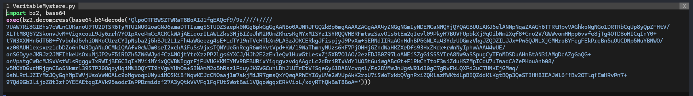
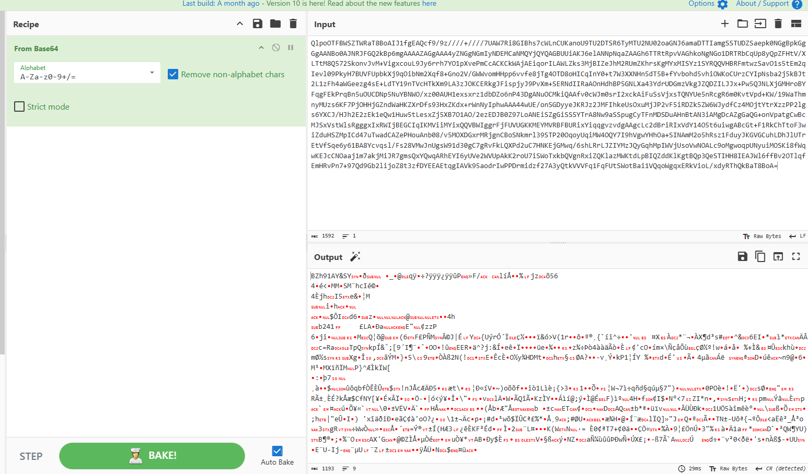
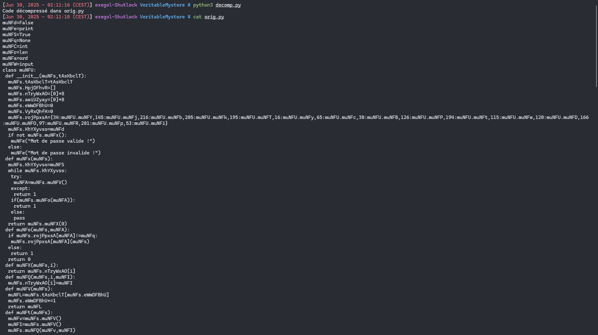
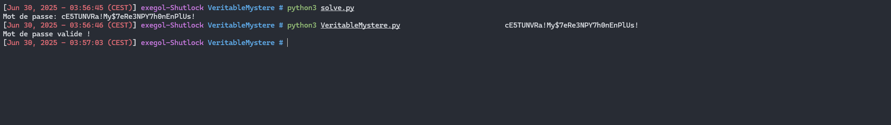

# Write-Up

Dans ce challenge, nous avons un script python nommé `VeritableMystere.py` :



Ce script importe différents modules (`bz2,base64,sys`), il lit `l'input()` de l'utilisateur et charge dynamiquement un blob compressé et encodé :

```python
exec(bz2.decompress(base64.b64decode('...')))
```

Ce `exec` décode d’abord la chaîne `Base64`, décompresse avec `BZ2`, puis exécute le code Python résultant.

Sans décompresser, il nous est impossible de connaître la logique interne de vérification du mot de passe.

On peut donc dans un premier temps décoder la chaîne en `Base64` à l'aide de `Cyberchef` et enregistrer le `blob bz2` :



Puis le décompresser avec le module `python` :

```python
import bz2

with open('blob.bz2', 'rb') as f:
    compressed = f.read()

code = bz2.decompress(compressed)

with open('orig.py', 'wb') as f:
    f.write(code)

print('Code décompressé dans orig.py')
```




Le code décompressé définit d’abord plusieurs alias :

```python
muNFd = False           # constante False
muNFe = print           # alias de print
muNFS = True            # constante True
muNFq = None            # constante None
muNFC = int             # alias de la fonction int()
muNFr = len             # alias de len()
muNFa = ord             # alias de ord()
muNFW = input           # alias de input()
```

Une Classe `muNFU` : **La VM**

```python
class muNFU:
    def __init__(muNFs, program_bytes):
        # programme à exécuter (bytes)
        muNFs.tAsKbclT = program_bytes
        # pile des valeurs PUSH/POP
        muNFs.HpjDFhvR = []
        # 8 registres généraux initialisés à 0
        muNFs.nTryWxAO = [0] * 8
        # 8 drapeaux pour les conditions
        muNFs.awiUZyay = [0] * 8
        # pointeur d'instruction
        muNFs.eWmDFBhU = 0
        # flag de boucle d'exécution
        muNFs.KhYXyvso = muNFd
        # dictionnaire opcode --> méthode
        muNFs.rojPpxsA = {
            34: muNFU.muNFY,  145: muNFU.muNFj, 216: muNFU.muNFb,
            205: muNFU.muNFk, 195: muNFU.muNFT, 16:  muNFU.muNFy,
            65: muNFU.muNFc,  30:  muNFU.muNFB, 126: muNFU.muNFP,
            194: muNFU.muNFt, 115: muNFU.muNFw, 120: muNFU.muNFD,
            166: muNFU.muNFO, 97:  muNFU.muNFR, 201: muNFU.muNFp,
            53: muNFU.muNFi
        }
        # exécution de la VM
        if not muNFs.muNFx():
            muNFe("Mot de passe valide !")
        else:
            muNFe("Mot de passe invalide !")
```

Lorsque la **VM** est lancée :

On lui donne en entrée une suite d’octets (program_bytes) qui contient toutes les instructions à exécuter.

Elle **initialise** :

- `Une pile (HpjDFhvR)` pour stocker temporairement des valeurs lors des opérations PUSH/POP.

- `Huit registres (nTryWxAO)`, numérotés R0 à R7, tous initialisés à 0.

- `Deux drapeaux (awiUZyay)` pour mémoriser le résultat des comparaisons (moins, égal, plus).

- `Un pointeur d’instruction` (eWmDFBhU) positionné au début du programme.

- `Une table de jump (rojPpxsA)` qui associe chaque code-opcode à la fonction Python qui l’implémente.


Une fois ces structures prêtes, la VM entre dans sa boucle principale : 


```python
def muNFx(muNFs):
    muNFs.KhYXyvso = True
    while muNFs.KhYXyvso:
        try:
            opcode = muNFs.muNFV() # F1: Fetch IP
        except IndexError:
            return 1 # fin du programme --> échec
        if muNFs.muNFo(opcode): # D2: Decode & Execute
            return 1 # opcode inconnu --> échec
    return muNFs.muNFX(0)# retourne R0 (0 = succès, 1 = échec)
```

Fetch : muNFV() lit l'octet à l'adresse IP puis incrémente IP.

Decode & Execute : muNFo(opcode) appelle la méthode correspondante ou fait échouer.

Termination : une instruction spéciale (muNFO) met KhYXyvso=False pour sortir.

Elle implémente également un accès aux registres : 


```python
# Fetch octet
def muNFV(muNFs):
    byte = muNFs.tAsKbclT[muNFs.eWmDFBhU]
    muNFs.eWmDFBhU += 1
    return byte

# Read register R[i]
def muNFX(muNFs, i):
    return muNFs.nTryWxAO[i]

# Write register R[i]
def muNFQ(muNFs, i, value):
    muNFs.nTryWxAO[i] = value
```

Chaque méthode associée à un opcode implémente une primitive classique :

```
muNFt : MOV immédiat --> R[v] = valeur suivante

muNFP : MOV registre --> R[v] = R[w]

muNFj / muNFY : ADD (immédiat ou registre)

muNFi : XOR immédiat --> R[v] ^= imm

muNFR : SHR --> R[v] >>= imm

muNFb : AND

muNFD / muNFw : PUSH / POP sur la pile

muNFB / muNFy / muNFc : sauts inconditionnels ou conditionnels

muNFp : CMP --> met à jour deux flags (<, ==, >)

muNFk : READ --> lit un caractère depuis l’entrée utilisateur

muNFO : END --> arrête la boucle d'exécution
```

Pour récupérer le flag on va, dans un seul script :

- Charger `VeritableMystere.py` et récupérer la longue chaîne Base64.

- Décoder puis décompresser cette chaîne pour obtenir le script Python de la VM.

Repérer dans ce code la ligne

```python
muNFU(b'…')
```
- Et récupérer le literal bytes qui est passé à la VM.

Ensuite on va parcourir ces octets un à un :

- Chaque fois que l’on rencontre l’opcode 0x35, c’est une instruction XOR imm ; on stocke alors la valeur immédiate dans la liste CONST.

- Chaque fois que l’on voit l’opcode 0xC2 appliqué au registre 5, c’est un SET_REG_IMM R5, bit ; on collecte ces bits par paquets de 8 pour former, à chaque fois, un nouvel octet qu’on ajoute à la liste EXPECTED.

Comme la VM valide le flag du dernier caractère vers le premier, il suffit d’inverser (reverse()) nos deux listes CONST et EXPECTED.

Pour finir, chaque octet du flag se reconstruit tout simplement par

```python
flag_byte = CONST[i] ^ EXPECTED[i]
```

Et on assemble ces 32 octets en une chaîne :

```
flag = bytes(CONST[i] ^ EXPECTED[i] for i in range(32)).decode('latin-1')
```

Script : 

```python
import re
import base64
import bz2
import ast
import sys

src = open("VeritableMystere.py", "r", encoding="utf-8").read()

m = re.search(r"b64decode\(\s*'([A-Za-z0-9+/=\s]+)'\s*\)", src, re.DOTALL)
if not m:
    sys.exit()
b64 = m.group(1).replace("\n", "").replace(" ", "")
inner = bz2.decompress(base64.b64decode(b64)).decode("utf-8", errors="replace")

m2 = re.search(r"muNFU\(\s*(b['\"][^'\"]+['\"])\s*\)", inner, re.DOTALL)
if not m2:
    sys.exit()
bytecode = list(ast.literal_eval(m2.group(1)))

CONST = []
EXPECTED = []
bits = []
i = 0

while i < len(bytecode):
    op = bytecode[i]

    if op == 0x35 and i + 2 < len(bytecode):
        CONST.append(bytecode[i + 2])
        i += 3
        continue

    if op == 0xC2 and i + 2 < len(bytecode) and bytecode[i + 1] == 5:
        bits.append(bytecode[i + 2] & 1)
        i += 3
        if len(bits) == 8:
            EXPECTED.append(sum(b << j for j, b in enumerate(bits)))
            bits = []
        continue

    i += 1

if len(CONST) != 32 or len(EXPECTED) != 32:
    sys.exit()

EXPECTED.reverse()

flag = bytes(c ^ e for c, e in zip(CONST, EXPECTED)).decode("latin-1")
print(f"Mot de passe: {flag}")
```



**Flag**

`SHLK{cE5TUNVRa!My$7eRe3NPY7h0nEnPlUs!}`